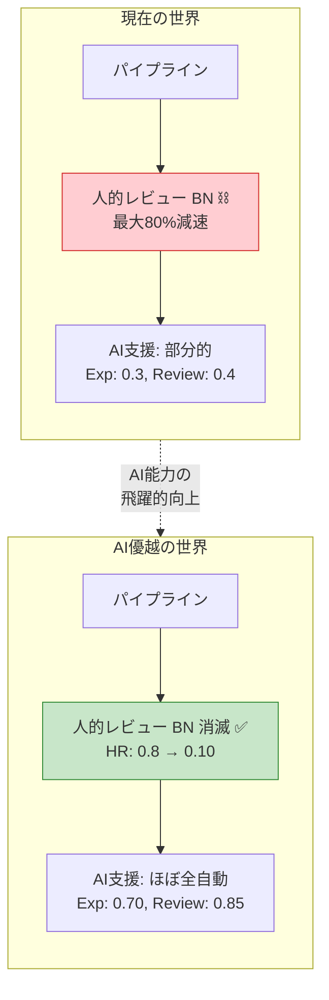
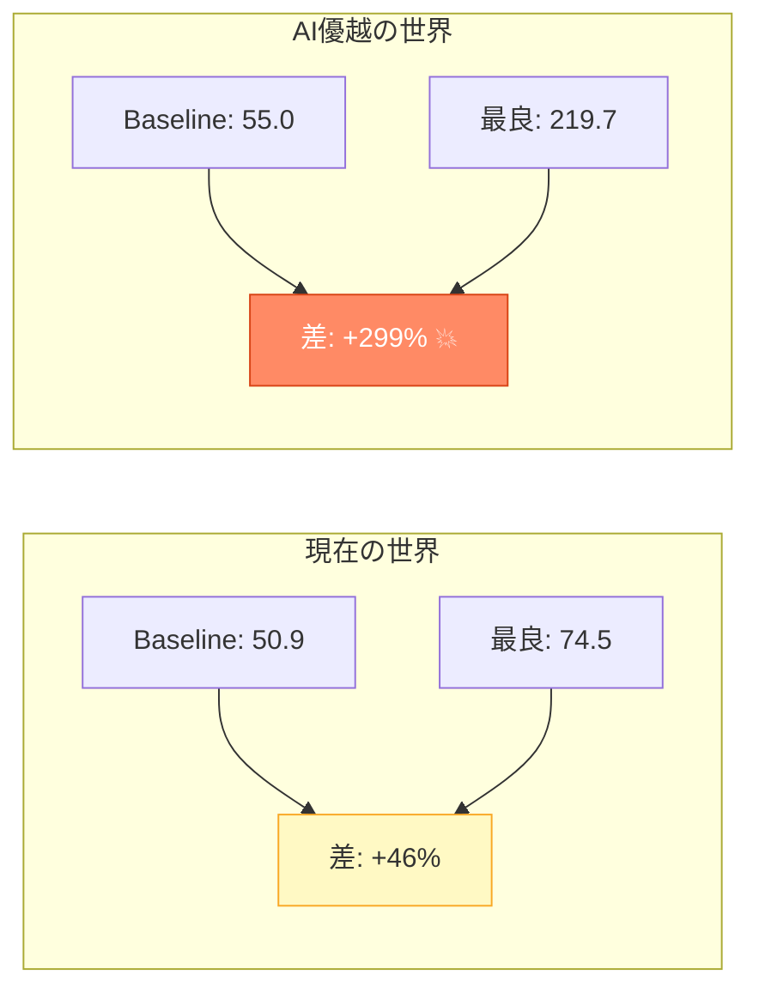
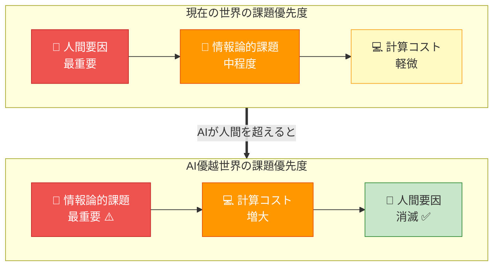
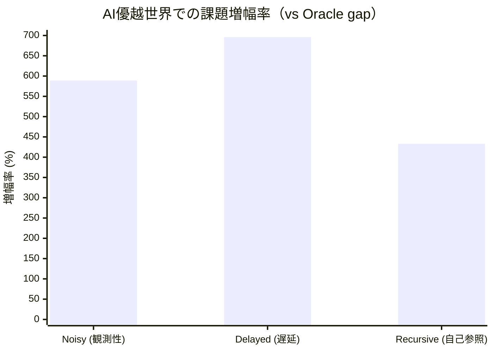
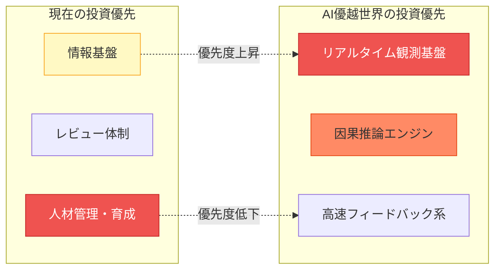

# AIが人間を上回る場合の課題変化

## 問い

> AIが人の能力を上回って基本的に人の能力よりも信頼できる場合には、管理コスト最適化の課題はどう変わるか？

## 2つの世界の構造的な違い



## 変更した前提

現在のシミュレーションには3つの「人間依存」がハードコードされている。AIが人間を超える世界では、これらの前提がすべて崩れる。

| パラメータ | 現在の世界 | AI優越の世界 | 意味 |
|---|---|---|---|
| `ai_automatable`（Survey） | 0.8 | 0.95 | ほぼ完全自動化 |
| `ai_automatable`（Hypothesis） | 0.6 | 0.90 | 仮説生成もAI |
| `ai_automatable`（Experiment） | 0.3 | **0.70** | 物理制約は残る |
| `ai_automatable`（Analysis） | 0.9 | 0.98 | ほぼ完全自動化 |
| `ai_automatable`（Review） | 0.4 | 0.85 | AIが査読 |
| `human_review_needed`（Review） | **0.8** | **0.10** | 人的レビュー不要 |
| `human_review_needed`（Writing） | **0.6** | **0.05** | AI自己検証 |
| 人的レビューボトルネック | **存在** | **消滅** | 構造的変化 |
| 不確実性のAI軽減率 | 50% | **85%** | エラー検出力向上 |
| 失敗のAI軽減率 | 30% | **70%** | 予防力向上 |

### 構造的変化: 人的レビューボトルネックの消滅

現在のモデルの核心的制約（`scientific_process.py:71-77`）:

```python
# 現在: AI支援が高くても人的レビューが律速になる
if ai_assistance > 0.5 and human_review_needed > 0.3:
    review_bottleneck = 1.0 - (human_review_needed * ai_assistance * 0.5)
    effective *= max(0.2, review_bottleneck)  # 最大80%の減速
```

AI優越世界ではこのボトルネックが**完全に消滅**する。AIが自己検証できるため、スループットの上限が大幅に引き上がる。

## 結果

### 数値サマリ

| 指標 | 現在の世界 | AI優越の世界 | 変化 |
|---|---|---|---|
| Baseline（管理なし） | 50.9 | 55.0 | +8% |
| **最良戦略の出力** | **74.5** | **219.7** | **+195%** |
| 最良戦略 | TrustDecay | TrustDecay | 同じ |

### 全バリアント比較

**現在の世界:**

| バリアント | Output | 合計OH |
|---|---|---|
| MetaAI-TrustDecay | 74.5 | 36.4 |
| Kanban (Fixed OH) | 73.4 | 37.0 |
| MetaAI-Oracle | 72.6 | 34.7 |
| MetaAI-Recursive | 71.5 | 47.8 |
| MetaAI-Delayed | 70.7 | 40.7 |
| MetaAI-Noisy | 70.3 | 43.3 |
| Baseline | 50.9 | 0.0 |

**AI優越の世界:**

| バリアント | Output | 合計OH |
|---|---|---|
| **TrustDecay (AI-Sup)** | **219.7** | 35.7 |
| Oracle (AI-Sup) | 203.8 | 28.7 |
| Recursive (AI-Sup) | 198.9 | 40.4 |
| Delayed (AI-Sup) | 190.8 | 40.2 |
| Noisy (AI-Sup) | 190.2 | 43.6 |
| Kanban (AI-Sup) | 182.3 | 37.1 |
| Baseline (AI-Sup) | 55.0 | 0.0 |

## 3つの構造的変化

### 変化1: 最適化の価値が爆発的に増大する



Baselineは8%しか改善しないのに、最良戦略は**195%**改善。

> **AIが優秀になるほど、管理最適化の重要性が「下がる」のではなく、逆に「上がる」。**

人間ボトルネックが消えた分、パイプライン全体の潜在能力が解放され、それを引き出す管理手法の差が**拡大**する。管理なし（Baseline）では潜在能力の大部分が無駄になる。

### 変化2: 「人間の信頼」課題は消滅し、むしろ強みに反転する

| 課題 | 現在の世界（vs Oracle gap） | AI優越の世界（vs Oracle gap） | 変化 |
|---|---|---|---|
| TrustDecay（人間要因） | -1.9（Oracleに勝利） | **-15.9**（大幅勝利） | **解消→強みに** |
| Noisy（観測性） | 2.3 | **13.6** | **6倍悪化** |
| Delayed（遅延） | 1.9 | **13.0** | **7倍悪化** |
| Recursive（自己参照） | 1.1 | **4.9** | **4倍悪化** |

TrustDecayが「人的調整コストを大胆に削減しても品質が落ちない」ため、Oracle（慎重に少しずつ削減）より速く無駄を除去できる。人間要因の課題が消えると、**最も攻撃的な戦略が最良になる**。

### 変化3: 情報論的課題はむしろ増幅される（最大の発見）

ここが直感に反するポイントである。

> **システムが速く動くほど、「見えない」「遅れる」「計測に自己コストがかかる」問題のダメージが大きくなる。**

**Noisy（観測性）: 589%増幅**
- 現在の世界では毎ステップの損失が小さいので誤推定の影響が軽微
- AI優越世界では1ステップあたりの潜在出力が大きいため、間違った方向への調整1回あたりの**機会損失が拡大**

**Delayed（遅延フィードバック）: 696%増幅**
- 高速システムでは12ステップの遅延中に累積する**逸失利益がはるかに大きい**
- 振動の振幅も拡大し、オーバーシュートのダメージが増す

**Recursive（自己参照コスト）: 433%増幅**
- メタAIのコストは人間コストではなく**AI計算コスト**なので、人間ボトルネック消滅の恩恵を受けない
- 管理OHが小さくなった世界で、メタAIのコストの**相対的重荷が増す**

## 課題の構造的シフト



### 課題増幅率



## 結論

### AIが人間を超えても消えない課題

1. **観測性の問題** -- 管理コストを正確にリアルタイム計測する基盤が不可欠
2. **因果推定の問題** -- 変更の効果を正しく帰属するための実験設計能力が必要
3. **遅延フィードバック** -- 高速システムほど遅延に脆弱（制御理論の古典的結果と一致）
4. **自己参照コスト** -- 最適化自体のコストには物理的下限がある

### AIが人間を超えると消える課題

1. **人的レビューボトルネック** -- AI自己検証により解消
2. **信頼の動態** -- 人的調整削減が品質劣化を起こさなくなる
3. **人的調整コスト** -- ほぼゼロに削減可能

### 実践的含意

> **AI優越世界での管理最適化には「リアルタイム観測基盤」と「因果推論能力」が決定的に重要になる。**

これは、AIが人間を超えた後の研究マネジメントにおいて、投資すべき領域が「人材管理」から「情報基盤」に根本的にシフトすることを意味する。



## 可視化

### 世界間比較

`poc/results/figures_v5/v5_01_world_comparison.png`

### 課題の持続性

`poc/results/figures_v5/v5_02_challenge_persistence.png`

### 課題の生存率

`poc/results/figures_v5/v5_05_challenge_survival.png`

### 効率フロンティア比較

`poc/results/figures_v5/v5_04_efficiency_both_worlds.png`

### 累積出力推移

`poc/results/figures_v5/v5_03_cumulative_comparison.png`

---

*実装: `poc/src/run_ai_superior.py`, `poc/src/meta_overhead_optimizer.py`*
