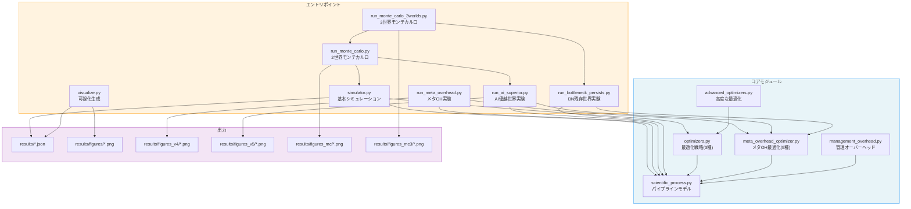
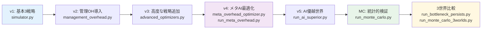
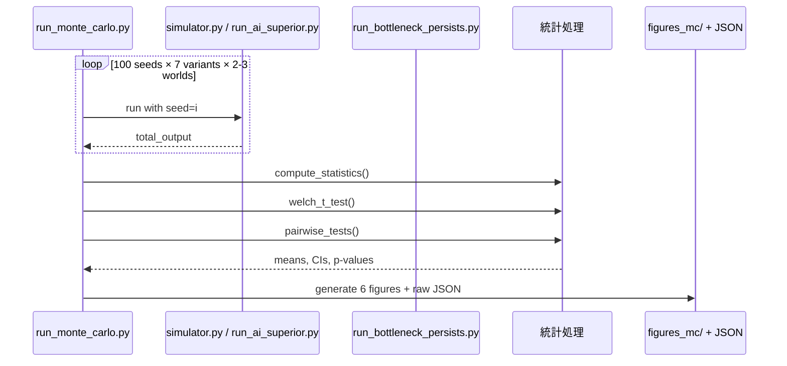
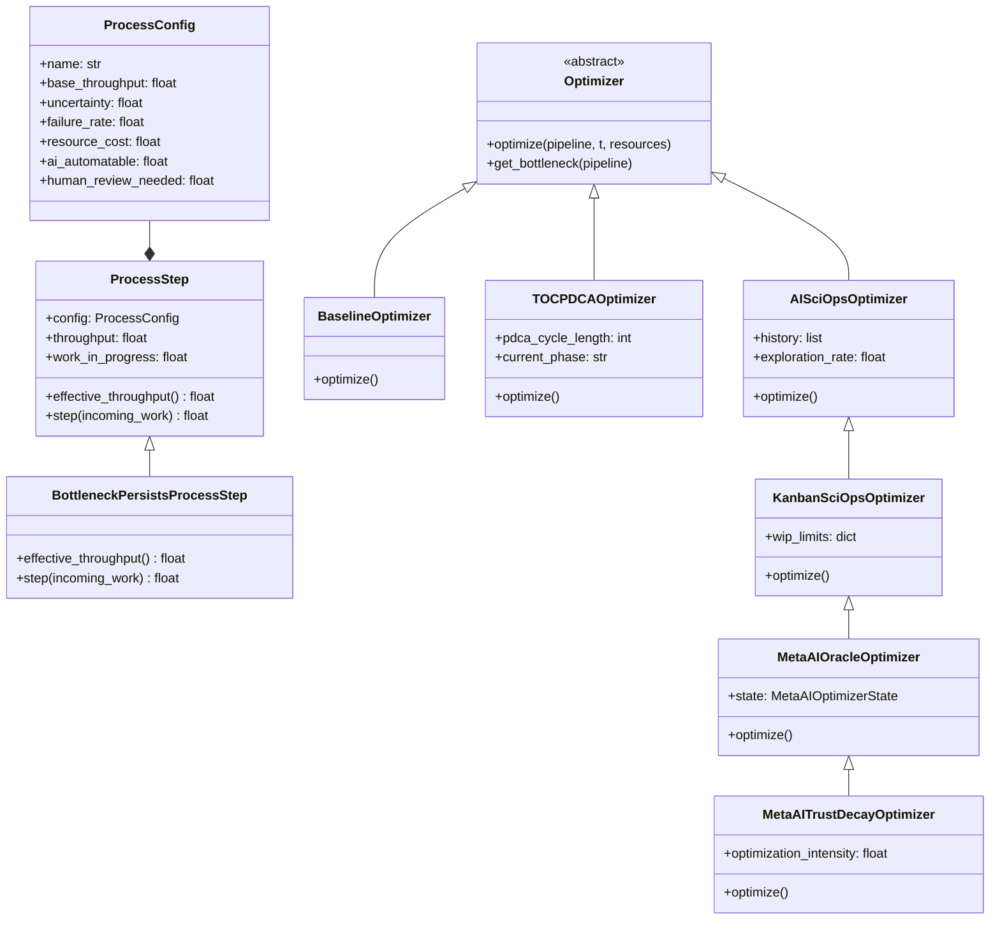

# コードアーキテクチャ

## モジュール依存関係



## ファイル構成

```
poc/
├── README.md                              # プロジェクト概要
├── src/
│   ├── scientific_process.py              # 科学パイプラインモデル
│   ├── optimizers.py                      # 基本最適化戦略（Baseline, TOC+PDCA, AI-SciOps）
│   ├── advanced_optimizers.py             # 高度な最適化戦略（Kanban-SciOps）
│   ├── simulator.py                       # シミュレーションエンジン
│   ├── management_overhead.py             # 管理オーバーヘッドモデル
│   ├── meta_overhead_optimizer.py         # メタAI最適化（5バリアント）
│   ├── visualize.py                       # 基本実験の可視化
│   ├── run_meta_overhead.py              # v4: メタOH実験の実行・可視化
│   ├── run_ai_superior.py               # v5: AI優越世界の実行・可視化
│   ├── run_bottleneck_persists.py        # BN残存世界の実行
│   ├── run_monte_carlo.py               # 2世界モンテカルロ（N=100）
│   └── run_monte_carlo_3worlds.py        # 3世界モンテカルロ（N=100）
└── results/
    ├── Baseline_No_Optimization.json      # Baseline結果データ
    ├── TOC_+_PDCA.json                    # TOC+PDCA結果データ
    ├── AI-SciOps_Autonomous_Optimization.json  # AI-SciOps結果データ
    ├── figures/                            # 基本実験の可視化（6枚）
    │   ├── 01_cumulative_output.png
    │   ├── 02_system_throughput.png
    │   ├── 03_bottleneck_analysis.png
    │   ├── 04_throughput_heatmap.png
    │   ├── 05_wip_accumulation.png
    │   └── 06_summary_comparison.png
    ├── figures_v4/                         # メタOH実験の可視化（5枚）
    │   ├── v4_01_meta_output_comparison.png
    │   ├── v4_02_meta_cumulative.png
    │   ├── v4_03_meta_profiles.png
    │   ├── v4_04_meta_challenges.png
    │   └── v4_05_meta_efficiency.png
    ├── figures_v5/                         # AI優越世界の可視化（5枚）
    │   ├── v5_01_world_comparison.png
    │   ├── v5_02_challenge_persistence.png
    │   ├── v5_03_cumulative_comparison.png
    │   ├── v5_04_efficiency_both_worlds.png
    │   └── v5_05_challenge_survival.png
    ├── figures_mc/                         # 2世界モンテカルロの可視化（6枚）+ JSON
    │   ├── mc_01_boxplot_current.png
    │   ├── mc_02_boxplot_superior.png
    │   ├── mc_03_confidence_intervals.png
    │   ├── mc_04_rank_stability.png
    │   ├── mc_05_significance_heatmap.png
    │   ├── mc_06_robustness.png
    │   └── monte_carlo_raw.json
    └── figures_mc3/                        # 3世界モンテカルロの可視化（6枚）+ JSON
        ├── mc3_01_boxplots_3worlds.png
        ├── mc3_02_variant_across_worlds.png
        ├── mc3_03_gain_decomposition.png
        ├── mc3_04_win_rates_3worlds.png
        ├── mc3_05_bnp_detail.png
        ├── mc3_06_trustdecay_vs_oracle.png
        └── monte_carlo_3worlds_raw.json
```

## 実験の系譜とモジュール対応



## モジュール設計

### `scientific_process.py` — パイプラインモデル

科学研究の個々のプロセスをデータクラスとして定義しています。

```
ProcessConfig（設定、不変）
  ├── name, base_throughput, uncertainty, failure_rate
  ├── resource_cost, ai_automatable, human_review_needed
  └── min_throughput, max_throughput

ProcessStep（実行時状態、可変）
  ├── config: ProcessConfig
  ├── throughput, allocated_resources, ai_assistance_level
  ├── work_in_progress, completed_units, failed_units
  ├── rework_units, human_review_backlog
  ├── effective_throughput() → AI支援・リソース・人間ボトルネックを考慮した実効スループット
  └── step(incoming_work) → 1タイムステップの処理を実行、出力を返す
```

**設計意図**: `ProcessConfig`（不変の構造パラメータ）と`ProcessStep`（可変のランタイム状態）を分離することで、最適化戦略が構造パラメータ自体を変更する（Stage 3-4）ケースも扱えるようにしています。

### `optimizers.py` — 基本最適化戦略

Strategy パターンを使い、3つの最適化アルゴリズムを統一インターフェースで実装しています。

```
Optimizer（抽象基底クラス）
  ├── optimize(pipeline, time_step, total_resources) → pipeline
  └── get_bottleneck(pipeline) → ProcessStep

BaselineOptimizer
  └── optimize(): 均等配分のみ

TOCPDCAOptimizer
  ├── pdca_cycle_length: int = 10
  ├── current_phase: Plan/Do/Check/Act
  └── optimize(): TOCボトルネック特定 + PDCAサイクル

AISciOpsOptimizer
  ├── history: list[dict]           — 過去の状態記録
  ├── exploration_rate: float       — 探索率（0.3→0.05に減衰）
  ├── learned_allocations: dict     — 学習済みリソース配分
  ├── process_pruned: set           — 枝刈り済みプロセス
  ├── _stage1_optimize()            — 人間フィードバック付き
  ├── _stage2_optimize()            — 自律的最適化
  ├── _stage3_optimize()            — プロセス枝刈り
  └── _stage4_optimize()            — メタプロセス再組織化
```

**設計意図**: `OptimizationAction`データクラスで全ての最適化介入を記録し、後から「いつ、どのプロセスに、どのような介入をしたか」を追跡可能にしています。

### `meta_overhead_optimizer.py` — メタAI最適化（5バリアント）

管理オーバーヘッド自体をAIで動的最適化する5つのバリアントを実装。

```
MetaAIOptimizerState（共通状態）
  ├── current_profile: OverheadProfile
  ├── optimization_history: list
  └── human_trust: float

MetaAIOracleOptimizer     — 完全情報で最適化
MetaAINoisyOptimizer      — ノイズ混じりの観測
MetaAIDelayedOptimizer    — 12ステップ遅延フィードバック
MetaAIRecursiveOptimizer  — 自己参照コスト（二次関数）
MetaAITrustDecayOptimizer — 人間信頼の動態（削減→崩壊→回復）
```

### `run_bottleneck_persists.py` — BN残存世界

AI能力が高いが人間レビューボトルネックが残存する世界のモデル。

```
BottleneckPersistsProcessStep（ProcessStepのサブクラス）
  ├── effective_throughput(): AI boost 2.5x + レビューBN維持
  └── step(): 不確実性削減85%, 失敗削減70%, バックログ蓄積

BottleneckPersistsSimulator（Simulatorのサブクラス）
BNPersistsOracleOptimizer
BNPersistsTrustDecayOptimizer
BNPersistsRecursiveOptimizer
```

### `run_monte_carlo.py` — モンテカルロ統計検証

100シードでの統計的検証エンジン。

```
run_single_seed(seed, variants) → {variant: output}
run_monte_carlo(n_seeds, variants) → {variant: [outputs]}
welch_t_test(a, b) → (t_stat, p_value)
compute_statistics(data) → {mean, std, ci, min, max}
pairwise_tests(data, reference) → [{variant, diff, t, p}]
generate_figures(stats, raw_data) → 6 PNG figures
```

### `simulator.py` — シミュレーションエンジン

パイプラインとオプティマイザーを組み合わせて実行し、メトリクスを収集します。

```
Simulator
  ├── optimizer: Optimizer
  ├── pipeline: list[ProcessStep]
  ├── run(time_steps) → SimulationResult
  │     各ステップで:
  │     1. optimizer.optimize() でパイプライン調整
  │     2. 各プロセスに作業を流す（直列）
  │     3. メトリクス収集
  └── SimulationResult
        ├── total_output: float
        ├── metrics: list[TimeStepMetrics]
        ├── optimization_actions: list[dict]
        └── final_state: dict

run_experiment()
  └── 3つのoptimizerで同一条件（seed=42）でSimulatorを実行し結果をJSONに保存
```

### `visualize.py` — 可視化

6種類のグラフを生成します：

| 図 | 関数 | 描画内容 |
|----|------|---------|
| 01 | `plot_cumulative_output()` | 3戦略の累積出力を時系列で比較 + Stage境界線 |
| 02 | `plot_system_throughput()` | 瞬時スループットの5ステップ移動平均 |
| 03 | `plot_bottleneck_analysis()` | 各プロセスがボトルネックだった回数の棒グラフ |
| 04 | `plot_process_throughputs_heatmap()` | プロセス×時間のスループットヒートマップ |
| 05 | `plot_wip_accumulation()` | 各プロセスのWIP蓄積を3戦略で比較 |
| 06 | `plot_summary_comparison()` | 最終的な4指標の棒グラフ比較 |

## データフロー

### 基本実験のデータフロー

```mermaid
sequenceDiagram
    participant Main as simulator.py
    participant SP as scientific_process.py
    participant OPT as optimizers.py
    participant JSON as results/*.json
    participant VIS as visualize.py
    participant PNG as figures/*.png

    Main->>SP: create_default_pipeline()
    SP-->>Main: pipeline (6 ProcessSteps)

    loop 3 strategies × 100 steps
        Main->>OPT: optimizer.optimize(pipeline, t)
        OPT-->>Main: 調整済みpipeline
        Main->>SP: step(incoming_work)
        SP-->>Main: output, metrics
    end

    Main->>JSON: save SimulationResult
    VIS->>JSON: load results
    VIS->>PNG: generate 6 figures
```

### モンテカルロ実験のデータフロー



## クラス階層



---

### 関連ページ

- [Home](./Home.md) | [実験の詳細設計](./Experiment-Design.md) | [結果の詳細解釈](./Results-Analysis.md)
- [管理コスト自体のAI最適化](./Meta-Overhead-Analysis.md) | [AI優越世界での課題変化](./AI-Superior-World-Analysis.md)
- [モンテカルロ実験](./Monte-Carlo-Analysis.md) | [ボトルネック残存世界の分析](./Bottleneck-Persists-Analysis.md)
- [論文との対応関係](./Paper-Mapping.md) | [今後の発展](./Future-Work.md)
