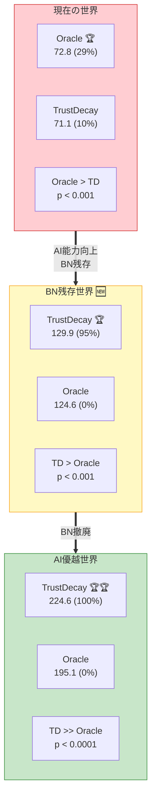
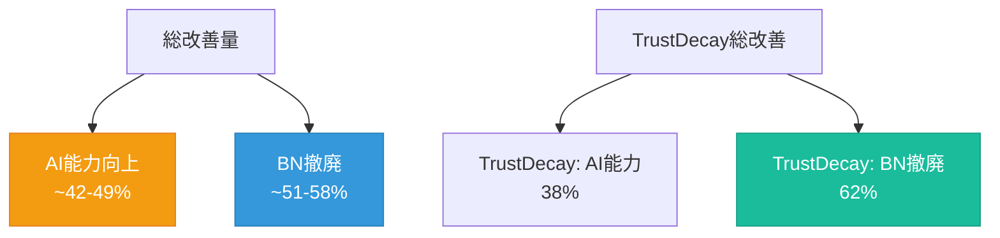
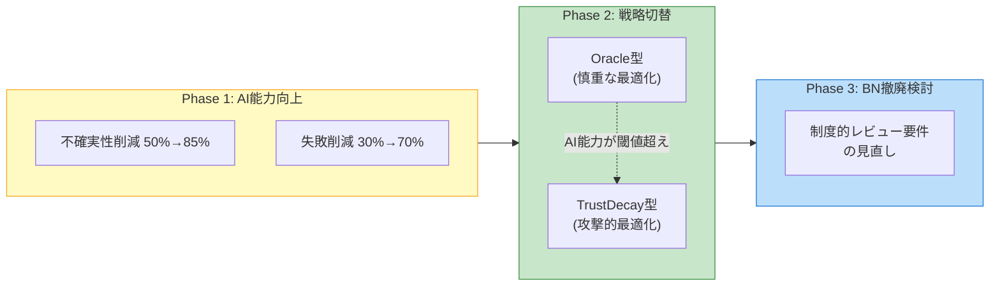
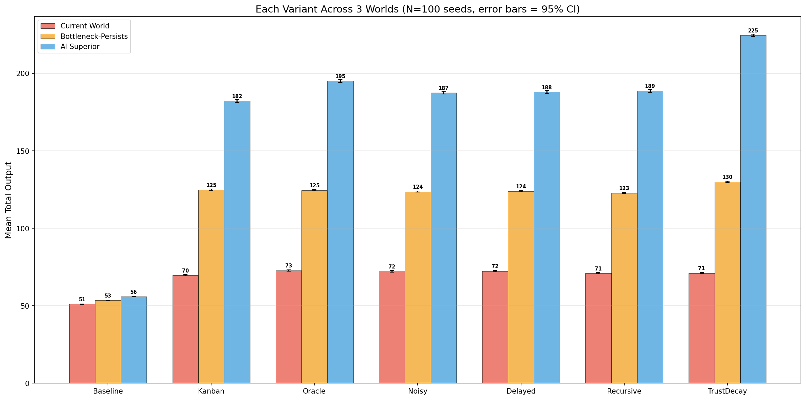

# ボトルネック残存世界の分析

## 問い

> AIの能力が向上しても、組織的・制度的・安全上の理由から人間のレビューが免除できない場合、最適化の構造はどう変わるか？

これは極めて現実的なシナリオである。医療AI、自律走行車、科学論文査読など、AIが人間より正確でも人間の承認が制度上必須な場面は多い。

## 3つの世界の定義

```mermaid
graph LR
    subgraph W1["現在の世界"]
        direction TB
        A1["AI能力: 通常"]
        B1["レビューBN: あり ⛓️"]
        C1["不確実性削減: 50%"]
    end

    subgraph W2["ボトルネック残存世界 🆕"]
        direction TB
        A2["AI能力: 高い ✨"]
        B2["レビューBN: あり ⛓️"]
        C2["不確実性削減: 85%"]
    end

    subgraph W3["AI優越世界"]
        direction TB
        A3["AI能力: 高い ✨"]
        B3["レビューBN: なし ✅"]
        C3["不確実性削減: 85%"]
    end

    W1 -->|"AI能力向上"| W2
    W2 -->|"BN撤廃"| W3

    style W1 fill:#ffcdd2,stroke:#d32f2f
    style W2 fill:#fff9c4,stroke:#f9a825
    style W3 fill:#c8e6c9,stroke:#388E3C
```

| パラメータ | 現在の世界 | BN残存世界 | AI優越世界 |
|---|---|---|---|
| `ai_automatable` | 0.3-0.9 | **0.70-0.98** | 0.70-0.98 |
| `human_review_needed` | 0.2-0.8 | **0.15-0.50** | 0.02-0.15 |
| AIブースト係数 | 2.0 | **2.5** | 2.5 |
| 不確実性削減率 | 50% | **85%** | 85% |
| 失敗削減率 | 30% | **70%** | 70% |
| レビューBNコード | **有効** | **有効** | 除去 |

## モンテカルロ結果 (N=100 seeds)

### ボトルネック残存世界の記述統計

| バリアント | 平均 | 標準偏差 | CV(%) | 95% CI | 1位率 |
|---|---|---|---|---|---|
| **TrustDecay** | **129.9** | 2.3 | 1.7 | [129.5, 130.4] | **95%** |
| Kanban | 124.8 | 2.6 | 2.1 | [124.3, 125.3] | 5% |
| Oracle | 124.6 | 1.9 | 1.5 | [124.2, 124.9] | 0% |
| Delayed | 123.9 | 1.7 | 1.4 | [123.5, 124.2] | 0% |
| Noisy | 123.6 | 1.7 | 1.4 | [123.3, 123.9] | 0% |
| Recursive | 122.8 | 1.8 | 1.5 | [122.4, 123.1] | 0% |
| Baseline | 53.5 | 0.7 | 1.2 | [53.4, 53.6] | 0% |

### 統計的検定（vs Oracle）

| バリアント | 平均差 | p値 | 有意性 |
|---|---|---|---|
| **TrustDecay** | **+5.38** | **0.000** | **有意 (p < 0.001)** |
| Kanban | +0.25 | 0.427 | 差なし |
| Delayed | -0.70 | 0.006 | 有意に劣る |
| Noisy | -0.96 | 0.000 | 有意に劣る |
| Recursive | -1.80 | 0.000 | 有意に劣る |

## 最重要発見: TrustDecayの条件依存的優位性

**TrustDecayは「AIの能力が十分に高い場合」にのみ優位になる。** ボトルネックの有無に関わらず、AI能力が高ければTrustDecayの攻撃的コスト削減が機能する。

| 世界 | 最良バリアント | TrustDecayの勝率 | TrustDecay vs Oracle |
|---|---|---|---|
| 現在の世界 | Oracle (29%) | 10% | **劣る** (p < 0.001) |
| BN残存世界 | **TrustDecay (95%)** | **95%** | **優る** (p < 0.001) |
| AI優越世界 | **TrustDecay (100%)** | **100%** | **圧倒** (p < 0.0001) |

### なぜBN残存世界でTrustDecayが勝つのか

現在の世界でTrustDecayがOracleに劣る理由は、**AIの能力不足**だった。

- 現在の世界: AIの不確実性削減=50%、失敗削減=30% → TrustDecayが人的コストを削ると品質が低下し、回復が不十分
- BN残存世界: AIの不確実性削減=85%、失敗削減=70% → TrustDecayが人的コストを削っても、AIが品質を補完できる

レビューボトルネックは残っているが、**AIの高い補完能力がTrustDecayの「削減→劣化→回復」サイクルを安定させる**。

## ゲインの分解: AI能力 vs ボトルネック撤廃

```mermaid
xychart-beta
    title "出力ゲインの分解（現在の世界からの改善）"
    x-axis ["Kanban", "Oracle", "Noisy", "Delayed", "Recursive", "TrustDecay"]
    y-axis "Output Gain" 0 --> 160
    bar [55, 52, 51, 52, 52, 59]
    bar [57, 71, 64, 64, 66, 95]
```

| バリアント | 現在 | BN残存 | AI優越 | AI能力ゲイン | BN撤廃ゲイン | AI能力の寄与率 |
|---|---|---|---|---|---|---|
| Kanban | 69.6 | 124.8 | 182.3 | +55.2 | +57.4 | **49%** |
| Oracle | 72.8 | 124.6 | 195.1 | +51.8 | +70.5 | **42%** |
| Noisy | 72.2 | 123.6 | 187.5 | +51.4 | +63.9 | **45%** |
| Delayed | 72.3 | 123.9 | 187.9 | +51.5 | +64.1 | **45%** |
| Recursive | 70.9 | 122.8 | 188.7 | +51.8 | +65.9 | **44%** |
| **TrustDecay** | 71.1 | 129.9 | 224.6 | **+58.8** | **+94.6** | **38%** |

### 構造的示唆

1. **大半のバリアントでは、AI能力とBN撤廃の寄与はほぼ半々**（42-49% vs 51-58%）
2. **TrustDecayだけが異なるパターン**: BN撤廃の寄与が62%と突出。TrustDecayの攻撃的戦略は、ボトルネックがない環境で特に大きな恩恵を受ける
3. **AI能力向上だけでも大幅な改善が得られる**: BNを撤廃できなくても、AI能力を高めるだけで出力は約70-80%改善する

## 実践的含意

### ボトルネックを撤廃できない場合の最適戦略

> **AIの能力が十分に高い場合、レビューボトルネックが残っていてもTrustDecay型の戦略（攻撃的削減→品質モニタリング→回復）が最適である。**

ただし、これはAIの不確実性削減が85%、失敗削減が70%の水準を前提とする。現在のAI能力（50%/30%）では、TrustDecayは逆効果になる。

### 段階的な実装指針

1. **AI能力が低い段階**: Oracle型（慎重な完全情報最適化）を採用
2. **AI能力が閾値を超えた段階**: TrustDecay型（攻撃的削減+モニタリング）に切替
3. **組織が準備できた段階**: レビューボトルネック自体の撤廃を検討

## 可視化

### 3世界の出力分布比較

### 各バリアントの3世界横断比較

### ゲインの分解（AI能力 vs BN撤廃）

### 3世界の勝率比較

### BN残存世界の詳細分析

### TrustDecay vs Oracle: 世界間推移

---

*実装: `poc/src/run_bottleneck_persists.py`, `poc/src/run_monte_carlo_3worlds.py`*
*データ: `poc/results/figures_mc3/monte_carlo_3worlds_raw.json`*
