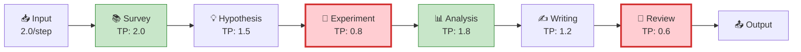
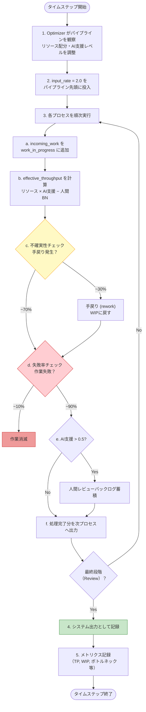
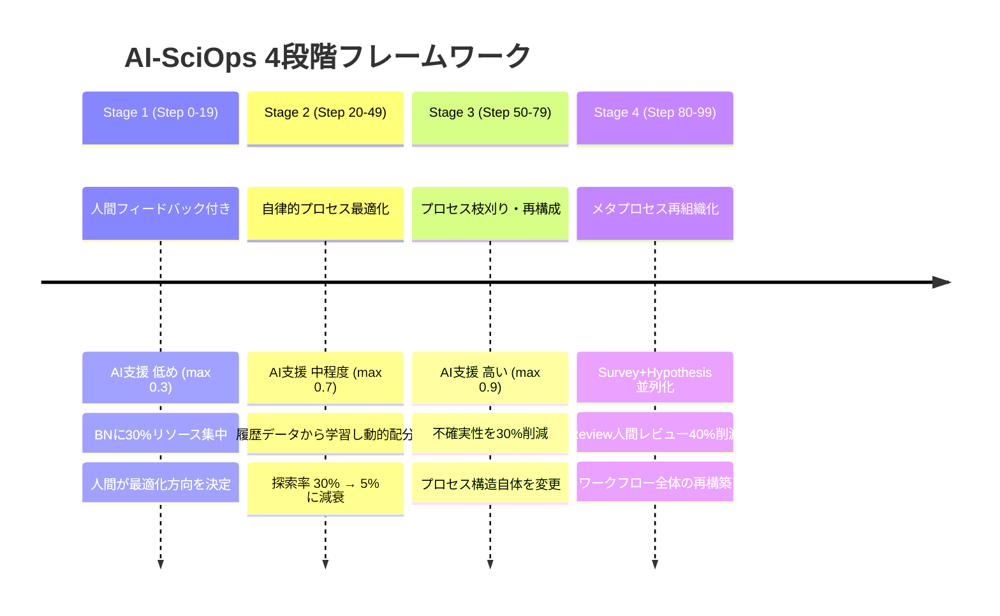
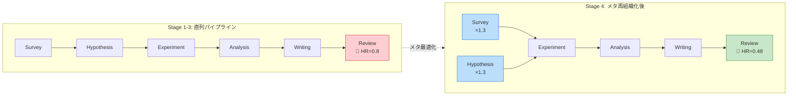

# 実験の詳細設計

## 1. 科学パイプラインのモデル化

### 基本構造

科学研究を**直列パイプライン**としてモデル化しています。各ステップの出力が次のステップの入力となる、生産ラインのような構造です。



> 赤色のプロセス（Experiment, Review）はスループットが低く、ボトルネックになりやすい。

毎タイムステップ、パイプラインの先頭に `input_rate = 2.0` の「研究課題」が投入され、最終段階のReviewを通過したものが「完了した研究成果」としてカウントされます。

### なぜ直列パイプラインなのか

論文では科学研究が「survey, hypothesis generation, preliminary experiments, and main experiments」という複数のプロセスから構成されると述べています（Section 1）。このPoCでは、これを最もシンプルな直列フローとしてモデル化しました。制約理論（TOC）の基本的な考え方は「チェーンの強度は最も弱いリンクで決まる」であり、直列パイプラインはこの原理を最も明確に検証できる構造です。

## 2. 各プロセスのパラメータ設計

### パラメータ一覧

| プロセス | スループット | 不確実性 | 失敗率 | リソースコスト | AI自動化可能度 | 人間レビュー必要度 |
|---------|------------|---------|--------|-------------|-------------|---------------|
| **Survey** | 2.0 | 0.2 | 0.05 | 1.0 | **0.8** | 0.2 |
| **Hypothesis** | 1.5 | 0.4 | 0.1 | 1.5 | 0.6 | 0.5 |
| **Experiment** | **0.8** | **0.5** | **0.15** | **3.0** | **0.3** | 0.3 |
| **Analysis** | 1.8 | 0.3 | 0.08 | 2.0 | **0.9** | 0.4 |
| **Writing** | 1.2 | 0.3 | 0.05 | 1.5 | 0.7 | 0.6 |
| **Review** | **0.6** | 0.2 | 0.1 | 1.0 | 0.4 | **0.8** |

### パラメータ設計の意図

各パラメータは、現実の科学研究プロセスの特徴を反映しています：

**Survey（文献調査）**
- スループットが最も高い（2.0）：既存文献を読む作業は比較的高速
- AI自動化可能度が高い（0.8）：LLMによる文献要約・検索が最も進んでいる領域
- 人間レビュー必要度が低い（0.2）：調査結果の品質チェックは比較的軽い

**Hypothesis（仮説生成）**
- 不確実性が中程度（0.4）：仮説の修正・再考が頻繁に発生
- AI自動化可能度が中程度（0.6）：AIは仮説候補を生成できるが、独創的な仮説には人間の直感が必要
- 人間レビュー必要度が中程度（0.5）：AIが生成した仮説の科学的妥当性は人間が判断

**Experiment（実験実行）**
- スループットが低い（0.8）：物理世界での実験は時間がかかる
- 不確実性が最も高い（0.5）：実験は試行錯誤が多い（論文Section 1の「reducing uncertainty」に対応）
- リソースコストが最大（3.0）：試薬、機器時間、人件費
- AI自動化可能度が最低（0.3）：物理実験のロボット化はまだ発展途上（論文Section 4.1の議論）

**Analysis（データ解析）**
- AI自動化可能度が最高（0.9）：データ解析はAIが最も得意とする領域
- 人間レビュー必要度が中程度（0.4）：AIの解析結果の解釈には人間の関与が必要

**Writing（論文執筆）**
- AI自動化可能度が高め（0.7）：LLMによる文章生成は進歩しているが、科学的正確性の担保が課題
- 人間レビュー必要度が高い（0.6）：AI生成文章の品質チェックは慎重に行う必要がある

**Review（査読対応）**
- スループットが最低（0.6）：査読プロセスは科学界で最も遅いプロセスの一つ
- AI自動化可能度が低い（0.4）：査読の自動化にはプロンプトインジェクション等のリスクがある（論文Section 3.2）
- 人間レビュー必要度が最高（0.8）：査読結果の最終判断は人間が行う必要がある

## 3. 各タイムステップの処理フロー



### 重要なメカニズム: 人間ボトルネック効果

`effective_throughput()` の計算で、論文が指摘する「人間がボトルネックになる」現象を実装しています：

```python
if ai_assistance_level > 0.5 and human_review_needed > 0.3:
    review_bottleneck = 1.0 - (human_review_needed * ai_assistance_level * 0.5)
    effective *= max(0.2, review_bottleneck)
```

AI支援レベルが高く（> 0.5）、かつ人間レビューが必要な場合（> 0.3）、実効スループットにペナルティが適用されます。これは論文Section 3.2の「人間の評価能力がスループットのボトルネックとなる」という議論の定量的モデル化です。

## 4. 3つの最適化戦略の詳細

### 4a. Baseline（管理なし）

```
リソース配分: 6.0 / 6プロセス = 1.0ずつ均等配分
AI支援: なし（全プロセス 0.0）
最適化: なし
```

「何もマネジメントしない」状態のベースライン。典型的な、管理の訓練を受けていない研究者がプロセスを回す状況のモデルです。

### 4b. TOC + PDCA（産業的管理手法）

**制約理論（TOC）の5集中ステップ:**
1. **IDENTIFY**: `effective_throughput()` が最も低いプロセスをボトルネックとして特定
2. **EXPLOIT**: ボトルネックにリソースの35%を集中配分
3. **SUBORDINATE**: 残り65%を他の5プロセスに均等配分
4. **ELEVATE**: ボトルネックの能力向上に投資
5. **REPEAT**: PDCAサイクルで繰り返し

**PDCAサイクル（10ステップ周期）:**
```
Plan  (0-0):  ボトルネック特定・改善計画
Do    (1-2):  リソース再配分を実行
Check (3-6):  スループット改善をモニタリング
Act   (7-9):  改善なら標準化、改善なければ計画修正
```

### 4c. AI-SciOps（AI自律最適化）

論文の4段階フレームワーク（Figure 1）を直接実装しています：



**Stage 1（Step 0-19）: 人間フィードバック付きプロセス置換**
- AI支援レベル: 低め（`ai_automatable × 0.3`、最大0.3）
- リソース配分: ボトルネックに30%、残りを均等配分
- 特徴: AIは控えめに支援し、人間が最適化の方向を決定

**Stage 2（Step 20-49）: 自律的プロセス最適化**
- AI支援レベル: 中程度（`ai_automatable × 0.7`、最大0.7）
- リソース配分: **過去5ステップの履歴データから学習して動的に決定**
  - WIP > スループット×2 → リソース×1.1（仕事が溜まっている）
  - WIP < スループット×0.5 → リソース×0.9（余裕がある）
- 探索率: 30%→徐々に減衰（exploration-exploitation トレードオフ）
- 特徴: AIが自らデータを分析し、最適配分を学習

**Stage 3（Step 50-79）: プロセスの枝刈り・再構成**
- AI支援レベル: 高い（`ai_automatable × 0.95`、最大0.9）
- プロセス枝刈り: AI支援度 > 0.7 のプロセスの不確実性を30%削減
  - 例: Survey の uncertainty 0.2 → 0.14
  - 例: Analysis の uncertainty 0.3 → 0.21
- 特徴: 単なるリソース配分を超え、**プロセスの構造自体を変更**

**Stage 4（Step 80-99）: メタプロセス再組織化**
- メタ最適化の実行（1回のみ）:
  - Survey + Hypothesis の並列実行：スループット×1.3
  - Review の人間レビュー必要度を40%削減（AIメタレビュー導入）
- 特徴: プロセス間の関係性や上位概念に踏み込んだ**ワークフロー全体の再構築**

#### Stage 4のパイプライン構造変化



## 5. シミュレーション条件

| パラメータ | 値 |
|-----------|-----|
| タイムステップ数 | 100 |
| 総リソース | 6.0 |
| 入力レート | 2.0 / step |
| 乱数シード | 42（再現性のため固定） |
| プロセス数 | 6 |
