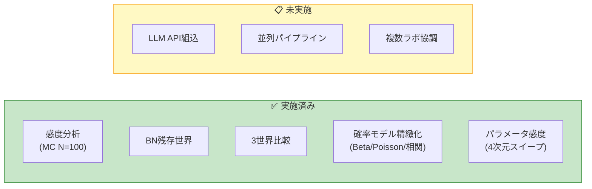
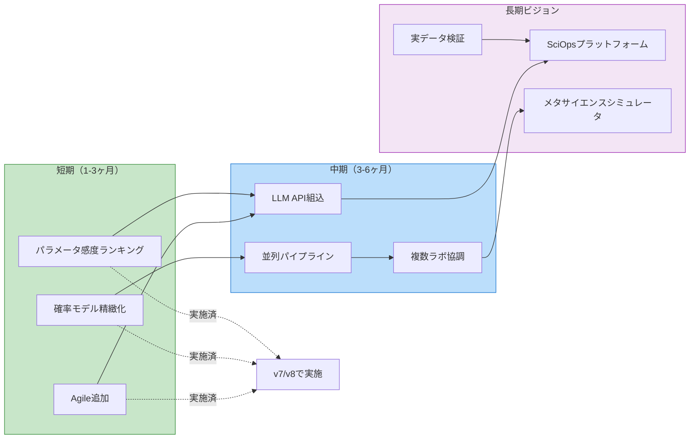
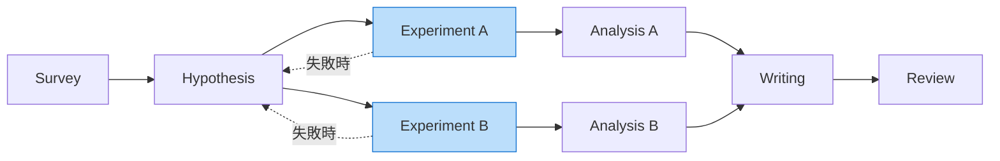

# 今後の発展

## 実施済みの改善

以下の項目は当初「今後の課題」として挙げられていたが、既に実施済みである。

### 感度分析 → モンテカルロ統計検証（実施済み）

> **100シード × 7バリアント × 3世界 = 2,100回のシミュレーション**を実施し、単一シードの結論を統計的に検証した。

- seed=42の結論が部分的に覆った（現在の世界でTrustDecay最良→Oracle最良に修正）
- Welchのt検定、95%信頼区間、勝率分析を実装
- → 詳細: [モンテカルロ実験](./Monte-Carlo-Analysis.md)

### ボトルネック残存世界の分析（実施済み）

> AIが優秀でも人間レビューが制度上必須な場合のシナリオを追加検証。

- 3世界比較フレームワーク（現在・BN残存・AI優越）を構築
- AI能力向上 vs ボトルネック撤廃のゲイン分解を実施
- → 詳細: [ボトルネック残存世界の分析](./Bottleneck-Persists-Analysis.md)

## ロードマップ全体像

## 短期的な改善

### 1. Agileフレームワークの追加
現在はTOCとPDCAのみ実装しているが、論文Section 2で詳しく議論されているAgile（スクラム）フレームワークを4番目の戦略として追加する。
- **スプリント単位の実行**: 固定タイムボックス内でのイテレーション
- **バックログ管理**: 優先順位付きのタスクキュー
- **レトロスペクティブ**: スプリント終了時のプロセス振り返り
- **比較**: TOC（ボトルネック集中）vs Agile（イテレーション）vs AI-SciOps（自律最適化）

### 2. 確率モデルの精緻化 → v7で実施済み

> **ベータ分布、ポアソン過程、プロセス間相関構造**を導入し、結論の頑健性を確認した。

- ベータ分布: 不確実性の非対称性を表現 ✅
- ポアソン過程: 失敗・ブレークスルーのイベントモデル化 ✅
- 相関構造: 5つのルール（実験失敗→仮説リワーク等） ✅
- **結果**: バリアントランキングは変化せず（AI-SciOps > TOC > Baseline > Kanban）。確率モデルは出力を~10%押し上げるが、順序は不変。
- → 詳細: [確率モデルの精緻化](./Probabilistic-Model-Analysis.md)

### 3. パラメータ感度ランキング → v8で実施済み

> **4パラメータの系統的スイープ**と**TrustDecay/Oracle閾値探索**を実施。

- 入力レート（1.0〜5.0）: AI-SciOpsで98.1%の感度 ✅
- リソース総量（3.0〜12.0）: 全バリアントで最重要（117-155%） ✅
- AI能力パラメータ: AI-SciOpsのみ108.9%の感度 ✅
- **TrustDecayクロスオーバー: AI能力~0.65で切り替わり** ✅
- → 詳細: [パラメータ感度分析](./Sensitivity-Analysis.md)

## 中期的な発展

### 4. 実際のLLM APIを組み込んだ動的最適化
現在のAI-SciOps optimizerはルールベースのシミュレーションだが、実際のLLM（Claude, GPT等）を組み込み、プロセス最適化の意思決定をAIに委ねる。
- LLMに現在のパイプライン状態を入力し、リソース配分を提案させる
- 過去の最適化履歴をコンテキストとして提供し、学習効果を再現
- 人間のフィードバックを実際に組み込んだStage 1の実装

### 5. 並列・分岐パイプラインへの拡張
現在は直列パイプラインだが、より現実的な研究プロセスを表現するため、並列・分岐構造をサポートする。

- 複数の仮説を並行検証するパターン
- 実験の失敗時に仮説に戻るフィードバックループ
- DAG（有向非巡回グラフ）としてのパイプライン表現

### 6. 複数ラボ間の協調最適化
単一ラボのパイプラインから、複数ラボが協調する**分散科学システム**へ拡張する。
- 各ラボが独自のパイプラインを持つ
- ラボ間でリソース（機器、データ、人材）を共有
- 論文Section 4.2で議論される「メタサイエンス」レベルの最適化を実装

## 長期的なビジョン

### 7. 実データによる検証
シミュレーションのパラメータを実際の研究プロジェクトのデータで校正する。
- 研究室の実験ログからプロセス時間を推定
- 論文投稿〜採択までの査読プロセスデータ
- AI導入前後のスループット変化の実測

### 8. Science Operations (SciOps) プラットフォーム
論文が提唱する「SciOps」を実際のツールとして実装する。
- 研究プロジェクトのリアルタイムモニタリング
- ボトルネック自動検出と改善提案
- AI支援レベルの段階的調整インターフェース
- 研究チーム向けダッシュボード

### 9. メタサイエンスシミュレーター
論文Section 4.2で議論される科学システム全体の最適化をシミュレーションする。
- 数百のラボからなる科学コミュニティのエージェントベースモデル
- 資金配分（SBIR、FRO型）の比較
- 査読システムの代替案（DeSci、MetaROR型）の評価
- 科学知識生産の長期的ダイナミクス

---

### 関連ページ

- [Home](./Home.md) | [実験の詳細設計](./Experiment-Design.md) | [コードアーキテクチャ](./Architecture.md)
- [結果の詳細解釈](./Results-Analysis.md) | [論文との対応関係](./Paper-Mapping.md)
- [管理コスト自体のAI最適化](./Meta-Overhead-Analysis.md) | [AI優越世界での課題変化](./AI-Superior-World-Analysis.md)
- [モンテカルロ実験](./Monte-Carlo-Analysis.md) | [ボトルネック残存世界の分析](./Bottleneck-Persists-Analysis.md)
