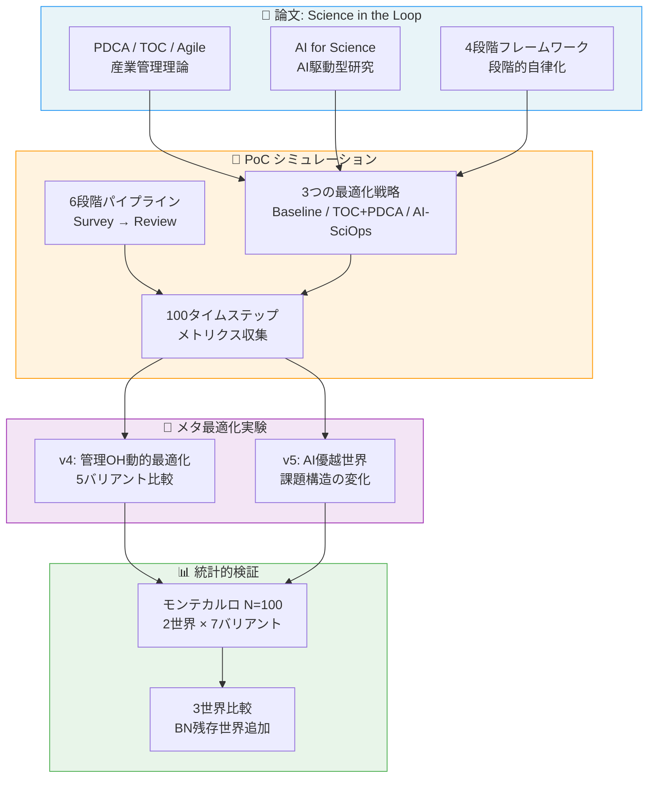
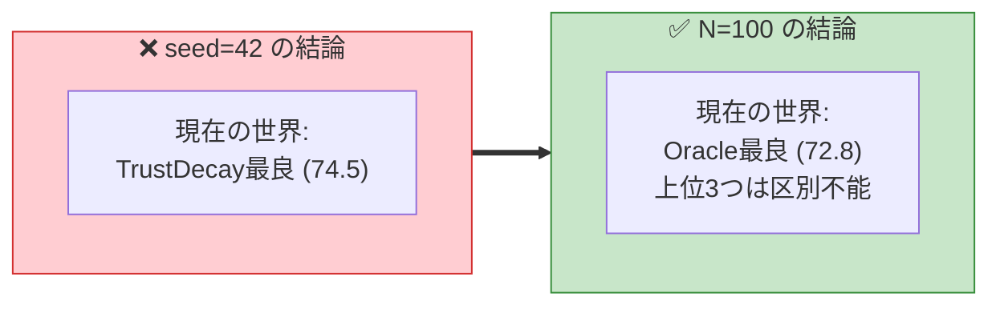
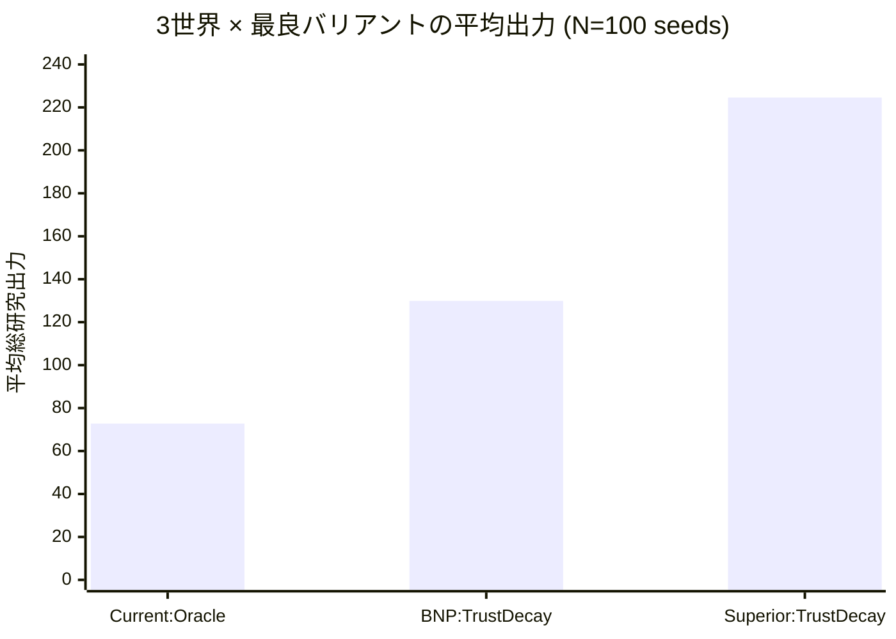
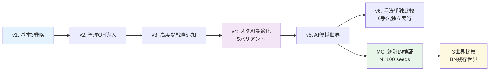

# DeSciTokyo - AI駆動型科学プロセス最適化 PoC

## プロジェクト概要

本プロジェクトは、論文「**Science in the Loop: AI時代における科学研究のプロセスマネジメントと最適化**」の主張をシミュレーション実験で検証するProof of Concept (PoC)です。

### 背景となる問い

> 産業界で長年培われてきたプロセスマネジメント理論（PDCA、アジャイル、制約理論）は、科学研究にも適用できるのか？さらに、AIがこれらの最適化を自律的に行うことで、研究のスループットはどの程度向上するのか？

### プロジェクト全体像



## 主要な発見

### 基本実験: AI-SciOpsが+36.6%の改善を達成

| 戦略 | 総研究出力 | 改善率 |
|------|-----------|--------|
| Baseline（管理なし） | 50.86 | - |
| TOC + PDCA（産業的管理手法） | 54.23 | +6.6% |
| AI-SciOps（AI自律最適化） | 69.48 | **+36.6%** |

→ 詳細: [結果の詳細解釈](./Results-Analysis.md)

### メタ最適化: 管理コスト自体のAI調整

5つの課題バリアント（Oracle、Noisy、Delayed、Recursive、TrustDecay）でAIが管理オーバーヘッドを動的調整。→ 詳細: [管理コスト自体のAI最適化](./Meta-Overhead-Analysis.md)

### モンテカルロ検証: 単一シードの結論を修正

100シードの統計検証により、**seed=42の結論が部分的に覆った**。



→ 詳細: [モンテカルロ実験](./Monte-Carlo-Analysis.md)

### 3世界比較: AI能力 vs ボトルネック撤廃の分解

| 世界 | AI能力 | レビューBN | 最良バリアント | 平均出力 |
|---|---|---|---|---|
| 現在の世界 | 通常 | あり | Oracle (29%) | 72.8 |
| BN残存世界 | 高い | あり | TrustDecay (95%) | 129.9 |
| AI優越世界 | 高い | なし | TrustDecay (100%) | 224.6 |

> **TrustDecayの優位はボトルネック撤廃ではなくAI能力の水準で決まる**

→ 詳細: [ボトルネック残存世界の分析](./Bottleneck-Persists-Analysis.md)

### 結果の視覚的サマリ



## Wiki 目次

### 基本実験
1. **[実験の詳細設計](./Experiment-Design.md)** - パイプラインモデル、パラメータ設計、各条件の詳細
2. **[コードアーキテクチャ](./Architecture.md)** - ソースコードの構造と各モジュールの役割
3. **[結果の詳細解釈](./Results-Analysis.md)** - 6つの可視化図の詳しい読み方と発見
4. **[論文との対応関係](./Paper-Mapping.md)** - シミュレーションの各要素が論文のどの議論に対応するか
5. **[今後の発展](./Future-Work.md)** - このPoCを発展させる方向性

### メタ最適化実験（v4/v5）
6. **[管理コスト自体のAI最適化](./Meta-Overhead-Analysis.md)** - AIが管理OHを動的調整する際の5つの課題をシミュレーション検証
7. **[AI優越世界での課題変化](./AI-Superior-World-Analysis.md)** - AIが人間を上回る場合に課題構造がどう変わるか

### 手法単独比較（v6）
10. **[Individual Methodology Comparison](./Methodology-Comparison.md)** - Baseline, TOC, PDCA, Agile, Kanban, AI-SciOpsを各手法単独で実施した比較実験

### 統計的検証（モンテカルロ）
8. **[モンテカルロ実験](./Monte-Carlo-Analysis.md)** - 100シードによる統計的検証。単一シードの結論が部分的に覆った重要な結果
9. **[ボトルネック残存世界の分析](./Bottleneck-Persists-Analysis.md)** - AIが優秀でも人間レビューが必須な場合の3世界比較

## クイックスタート

```bash
cd poc/src
pip install matplotlib numpy

# 基本実験
python simulator.py           # 基本シミュレーション
python visualize.py           # 可視化生成

# メタ最適化実験
python run_meta_overhead.py   # v4: 管理OH最適化
python run_ai_superior.py     # v5: AI優越世界

# 手法単独比較
python run_methodology_comparison.py  # v6: 6手法を単独で比較

# 統計的検証
python run_monte_carlo.py             # 2世界モンテカルロ (N=100)
python run_monte_carlo_3worlds.py     # 3世界モンテカルロ (N=100)
```

## 実験の系譜


