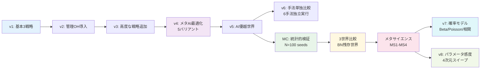

# SciOps-Sim: AI駆動型科学プロセス最適化シミュレーション

## プロジェクト概要

本プロジェクトは、論文「**Science in the Loop: AI時代における科学研究のプロセスマネジメントと最適化**」の主張をシミュレーション実験で検証するProof of Concept (PoC)です。

> 産業界で長年培われてきたプロセスマネジメント理論（PDCA、アジャイル、制約理論）は、科学研究にも適用できるのか？AIがこれらの最適化を自律的に行うことで、研究のスループットはどの程度向上するのか？

---

## 全実験結果から得られた主要インサイト

### インサイト1: AI-SciOpsは研究スループットを+36.6%向上させる

6段階パイプライン（Survey → Hypothesis → Experiment → Analysis → Writing → Review）の基本実験で、AI自律最適化は従来の管理手法を大幅に上回る。

| 戦略 | 総研究出力 | 改善率 |
|------|-----------|--------|
| Baseline（管理なし） | 50.86 | — |
| TOC + PDCA（産業的管理） | 54.23 | +6.6% |
| **AI-SciOps（AI自律最適化）** | **69.48** | **+36.6%** |

6手法単独比較（v6）でも、AI-SciOpsが圧倒的首位。TOC、PDCA、Agile、Kanbanはいずれも+10%以内の改善にとどまる。

→ 詳細: [結果の詳細解釈](./Results-Analysis.md)

### インサイト2: 単一シードの結論は危険 — 統計的検証が覆した事実

seed=42の単一実験では「TrustDecay最良」という結論だったが、**N=100のモンテカルロ統計検証で覆った**。

| 項目 | seed=42の結論 | N=100の統計結論 |
|------|-------------|---------------|
| 現在の世界の最良 | TrustDecay (74.5) | **Oracle (72.8)** |
| 上位3バリアント | 明確に分離 | **95%CIが重複、区別不能** |
| TrustDecay優位の理由 | ボトルネック撤廃 | **AI能力水準が原因** |

**教訓**: シミュレーション研究では単一シードの結論は信頼できない。必ず統計的検証が必要。

→ 詳細: [モンテカルロ実験](./Monte-Carlo-Analysis.md)

### インサイト3: TrustDecay vs Oracle の切り替わりはAI能力~0.65が閾値

パラメータ感度分析（v8）で、TrustDecayがOracleを上回る条件を定量的に特定。

| AI能力水準 | 勝者 | 理由 |
|-----------|------|------|
| < 0.65 | **Oracle** | 低AI能力では完全情報による最適化が有利 |
| > 0.65 | **TrustDecay** | 高AI能力では信頼に基づくOH削減が過剰管理を防ぐ |

3世界比較の結果と一致:
- 現在の世界（通常AI能力）→ Oracle優位
- BN残存世界（高AI能力）→ TrustDecay優位（95%勝率）
- AI優越世界（最高AI能力）→ TrustDecay優位（100%勝率）

→ 詳細: [パラメータ感度分析](./Sensitivity-Analysis.md) | [ボトルネック残存世界の分析](./Bottleneck-Persists-Analysis.md)

### インサイト4: リソース総量が研究生産性の最も根本的な制約

パラメータ感度分析（v8）で4パラメータをスイープした結果:

| パラメータ | Baseline | TOC | Kanban | AI-SciOps |
|-----------|---------|-----|--------|-----------|
| 入力レート | 0.1% | 2.2% | 75.0% | 98.1% |
| **リソース総量** | **119.9%** | **117.2%** | **155.2%** | **146.4%** |
| AI能力 | 0.0% | 0.0% | 0.0% | 108.9% |
| 人間レビュー必要度 | 15.9% | 57.1% | 26.7% | 29.7% |

**リソース総量が全バリアントで最も影響力の大きいパラメータ（117-155%）**。研究生産性の向上は、管理手法の選択よりもリソースの絶対量に最も強く依存する。

→ 詳細: [パラメータ感度分析](./Sensitivity-Analysis.md)

### インサイト5: 確率モデルの精緻化は結論の頑健性を確認

一様分布をベータ分布・ポアソン過程に置き換え、プロセス間相関を導入しても:

| バリアント | 一様分布 | 確率モデル | 差分 | p値 |
|-----------|---------|-----------|------|-----|
| AI-SciOps | 66.41 | 73.61 | +10.8% | <0.001 |
| TOC | 56.08 | 56.01 | -0.1% | 0.788 |
| Baseline | 50.96 | 55.22 | +8.4% | <0.001 |
| Kanban | 43.29 | 47.78 | +10.4% | <0.001 |

**ランキング順序は不変（AI-SciOps > TOC > Baseline > Kanban）**。結論はモデル選択に対して頑健。

→ 詳細: [確率モデルの精緻化](./Probabilistic-Model-Analysis.md)

### インサイト6: メタサイエンス実験 — 科学システム全体の最適化

50ラボ×200タイムステップのエコシステムシミュレーション（MS1-MS4）から:

| 実験 | 最重要発見 |
|------|----------|
| **MS1: 出版バイアス** | p-hackingが偽陽性率を8%→28%に3.4倍増加。AIはp-hackingを防げない |
| **MS2: 再現性危機** | AI再現ボットがTruth Ratioを0.638→0.870に最も改善。事前登録制も有効（0.773） |
| **MS3: 資金配分** | ピアレビューが最多ブレークスルー（1,801件）。FROは低出力だが高効率 |
| **MS4: オープンサイエンス** | AI+オープンが最高出力（5,719）。フリーライダー問題は存在するが全体最適を妨げず |

→ 詳細: [メタサイエンス概要](./Meta-Science-Overview.md)

---

## 実験の全体像



**全実験で83の可視化図、27のPythonソースファイル、8つのJSON統計データファイルを生成。**

---

## 定量的実験サマリ

| 実験 | 規模 | 可視化 | 主要結論 |
|------|------|--------|---------|
| v1-v3: 基本実験 | 3戦略×100ステップ | 18枚 | AI-SciOps +36.6% |
| v4: メタOH最適化 | 5 AIバリアント | 5枚 | Oracle vs TrustDecay対立 |
| v5: AI優越世界 | 3世界比較 | 5枚 | 課題構造の変化を確認 |
| v6: 手法単独比較 | 6手法独立実行 | 7枚 | AI-SciOps圧倒的首位 |
| MC: モンテカルロ | N=100×7×2世界=1,400回 | 6枚 | seed=42の結論を修正 |
| MC3: 3世界MC | N=100×7×3世界=2,100回 | 6枚 | ゲイン分解成功 |
| MS1: 出版バイアス | 50ラボ×200ステップ | 6枚 | FPR 3.4倍増加 |
| MS2: 再現性危機 | 50ラボ×5制度 | 6枚 | AI再現ボット最良 |
| MS3: 資金配分 | 50ラボ×4メカニズム | 6枚 | ピアレビュー最多BT |
| MS4: オープン科学 | 50ラボ×5モデル | 6枚 | AI+オープン最高出力 |
| v7: 確率モデル | N=50×4×2モデル | 6枚 | ランキング頑健性確認 |
| v8: パラメータ感度 | 4パラメータスイープ | 6枚 | TD/Oracle閾値発見 |

---

## Wiki 目次

### 基本実験
1. **[実験の詳細設計](./Experiment-Design.md)** — パイプラインモデル、パラメータ設計、各条件の詳細
2. **[コードアーキテクチャ](./Architecture.md)** — ソースコードの構造と各モジュールの役割
3. **[結果の詳細解釈](./Results-Analysis.md)** — 6つの可視化図の詳しい読み方と発見
4. **[論文との対応関係](./Paper-Mapping.md)** — シミュレーションの各要素が論文のどの議論に対応するか

### メタ最適化実験（v4/v5）
5. **[管理コスト自体のAI最適化](./Meta-Overhead-Analysis.md)** — AIが管理OHを動的調整する際の5つの課題
6. **[AI優越世界での課題変化](./AI-Superior-World-Analysis.md)** — AIが人間を上回る場合に課題構造がどう変わるか

### 手法単独比較（v6）
7. **[Individual Methodology Comparison](./Methodology-Comparison.md)** — 6手法を各単独で実施した比較

### 統計的検証（モンテカルロ）
8. **[モンテカルロ実験](./Monte-Carlo-Analysis.md)** — N=100の統計的検証。単一シードの結論を修正
9. **[ボトルネック残存世界の分析](./Bottleneck-Persists-Analysis.md)** — 3世界比較フレームワーク

### モデル精緻化・感度分析（v7/v8）
10. **[確率モデルの精緻化](./Probabilistic-Model-Analysis.md)** — ベータ分布・ポアソン過程・プロセス間相関
11. **[パラメータ感度分析](./Sensitivity-Analysis.md)** — 4パラメータスイープとTD/Oracle閾値

### メタサイエンス実験（MS1-MS4）
12. **[メタサイエンス概要](./Meta-Science-Overview.md)** — 4実験の全体像とアーキテクチャ
13. **[MS1: 出版バイアスと偽陽性蓄積](./Meta-Science-MS1.md)** — p-hackingの影響
14. **[MS2: 再現性危機ダイナミクス](./Meta-Science-MS2.md)** — 5つのインセンティブ制度比較
15. **[MS3: 資金配分メカニズム比較](./Meta-Science-MS3.md)** — 4つの資金配分戦略
16. **[MS4: オープンサイエンス](./Meta-Science-MS4.md)** — 知識ネットワーク効果とフリーライダー

### ロードマップ
17. **[今後の発展](./Future-Work.md)** — 短期・中期・長期のロードマップ

---

## クイックスタート

```bash
cd poc/src
pip install matplotlib numpy

# 基本実験
python simulator.py                    # 基本シミュレーション
python visualize.py                    # 可視化生成

# メタ最適化実験
python run_meta_overhead.py            # v4: 管理OH最適化
python run_ai_superior.py              # v5: AI優越世界

# 手法単独比較
python run_methodology_comparison.py   # v6: 6手法を単独で比較

# 統計的検証
python run_monte_carlo.py              # 2世界モンテカルロ (N=100)
python run_monte_carlo_3worlds.py      # 3世界モンテカルロ (N=100)

# メタサイエンス実験
python run_ms1_publication_bias.py     # MS1: 出版バイアス
python run_ms2_replication_crisis.py   # MS2: 再現性危機
python run_ms3_funding_comparison.py   # MS3: 資金配分
python run_ms4_open_science.py         # MS4: オープンサイエンス

# モデル精緻化・感度分析
python run_probabilistic.py            # v7: 確率モデル精緻化
python run_sensitivity.py              # v8: パラメータ感度分析
```
