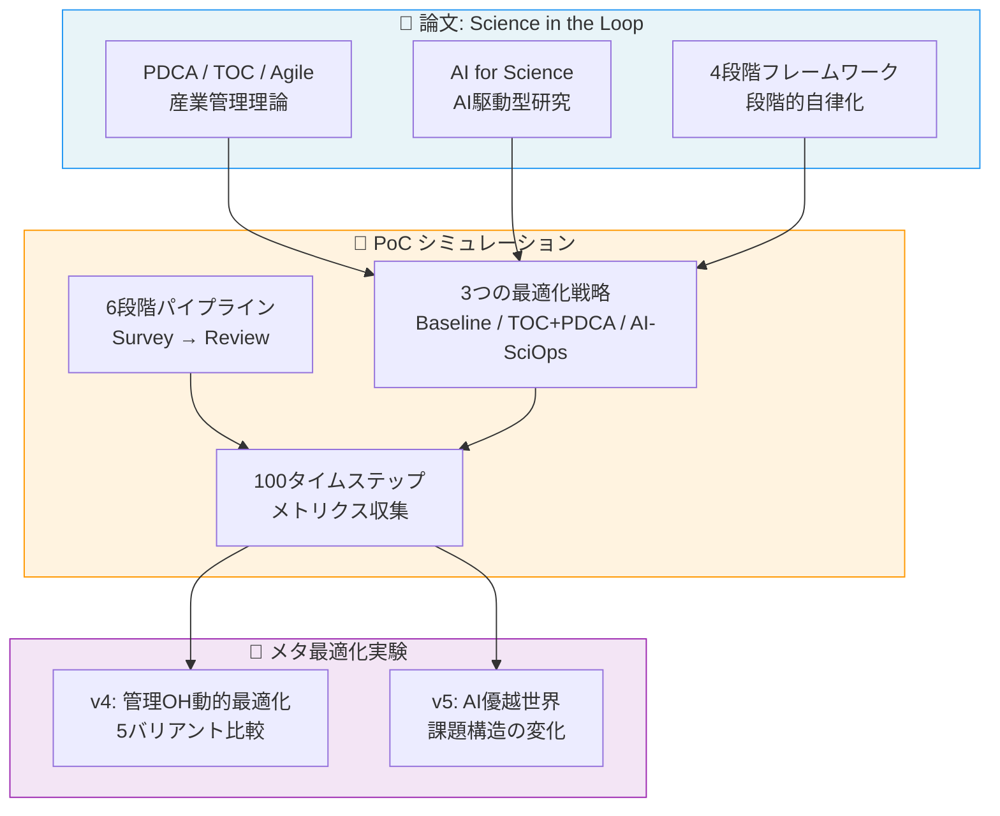
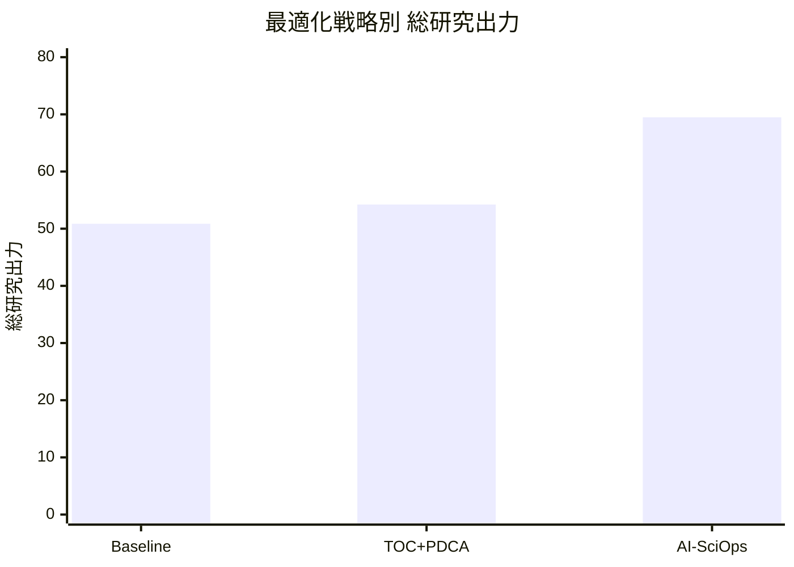

# DeSciTokyo - AI駆動型科学プロセス最適化 PoC

## プロジェクト概要

本プロジェクトは、論文「**Science in the Loop: AI時代における科学研究のプロセスマネジメントと最適化**」の主張をシミュレーション実験で検証するProof of Concept (PoC)です。

### 背景となる問い

> 産業界で長年培われてきたプロセスマネジメント理論（PDCA、アジャイル、制約理論）は、科学研究にも適用できるのか？さらに、AIがこれらの最適化を自律的に行うことで、研究のスループットはどの程度向上するのか？

### プロジェクト全体像



### このPoCが示すこと

科学研究の6段階パイプラインをシミュレーションし、**3つの最適化戦略**を100タイムステップにわたって比較しました。

| 戦略 | 総研究出力 | 改善率 |
|------|-----------|--------|
| Baseline（管理なし） | 50.86 | - |
| TOC + PDCA（産業的管理手法） | 54.23 | +6.6% |
| AI-SciOps（AI自律最適化） | 69.48 | **+36.6%** |

### 結果の視覚的サマリ



## Wiki 目次

### 基本実験
1. **[実験の詳細設計](./Experiment-Design.md)** - パイプラインモデル、パラメータ設計、各条件の詳細
2. **[コードアーキテクチャ](./Architecture.md)** - ソースコードの構造と各モジュールの役割
3. **[結果の詳細解釈](./Results-Analysis.md)** - 6つの可視化図の詳しい読み方と発見
4. **[論文との対応関係](./Paper-Mapping.md)** - シミュレーションの各要素が論文のどの議論に対応するか
5. **[今後の発展](./Future-Work.md)** - このPoCを発展させる方向性

### メタ最適化実験（v4/v5）
6. **[管理コスト自体のAI最適化](./Meta-Overhead-Analysis.md)** - AIが管理オーバーヘッドを動的調整する際の5つの課題をシミュレーション検証
7. **[AI優越世界での課題変化](./AI-Superior-World-Analysis.md)** - AIが人間を上回る場合に課題構造がどう変わるか（情報論的課題の増幅）

### 統計的検証
8. **[モンテカルロ実験](./Monte-Carlo-Analysis.md)** - 100シードによる統計的検証。単一シードの結論が部分的に覆った重要な結果
9. **[ボトルネック残存世界の分析](./Bottleneck-Persists-Analysis.md)** - AIが優秀でも人間レビューが必須な場合の3世界比較。AI能力ゲインとBN撤廃ゲインの分解

## クイックスタート

```bash
cd poc/src
pip install matplotlib numpy
python simulator.py    # シミュレーション実行
python visualize.py    # 可視化生成
```
