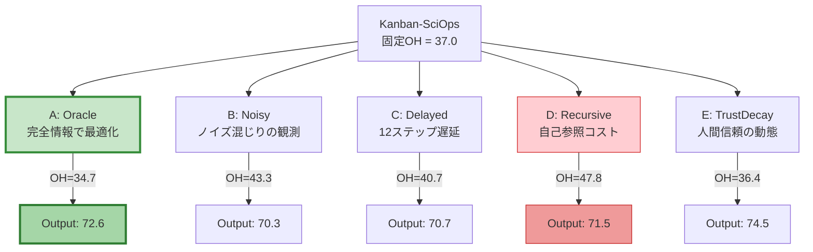
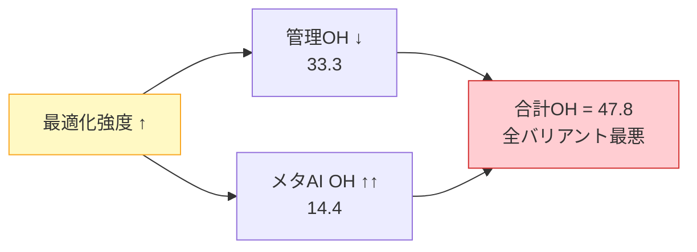
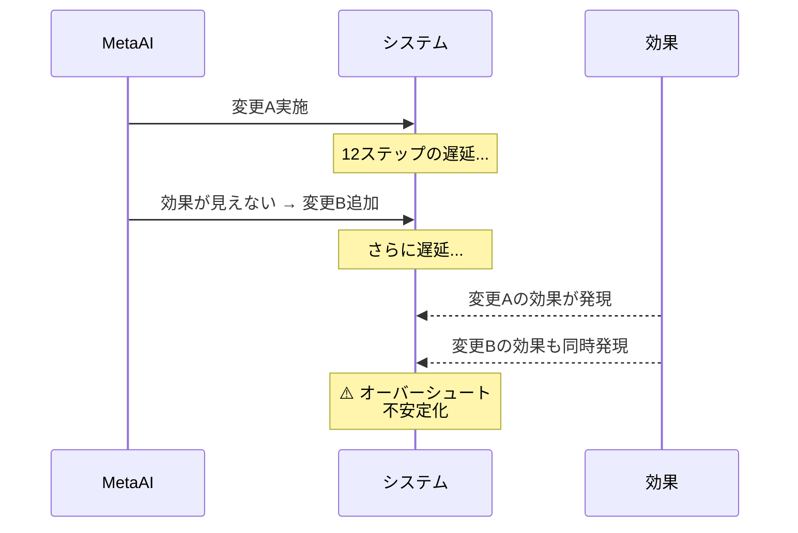
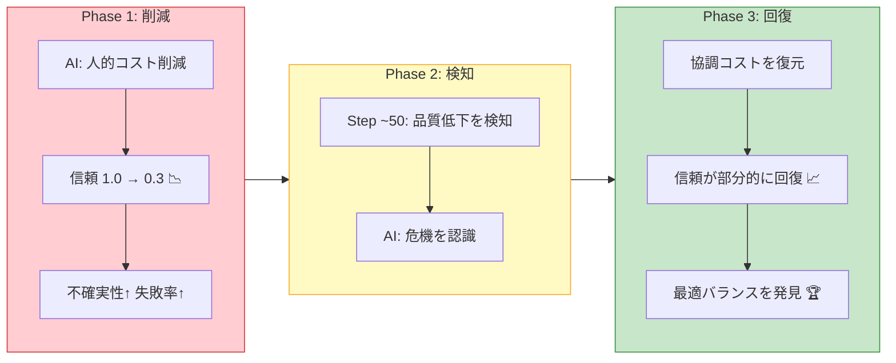
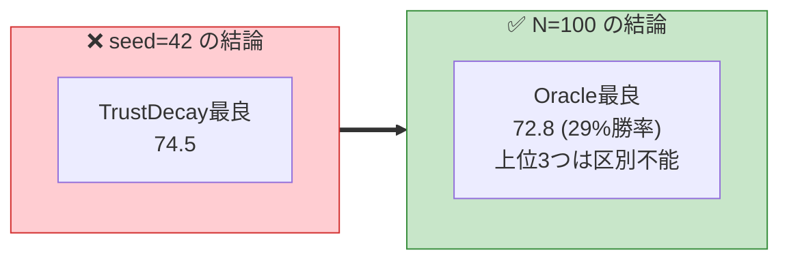

# 管理コスト自体をAIで調整する際のシミュレーション課題

## 概要

「管理コストの最適化」は論文のStage 4（メタプロセス再編成）に相当するメタレベルの問題である。AIが管理オーバーヘッドを動的に調整する5つのバリアントを実装し、それぞれが直面する根本的課題をシミュレーションで検証した。

## 実験設計

Kanban-SciOps（固定オーバーヘッド）をベースに、AIが管理コストを動的に調整する5つのバリアントを実装・比較。

### バリアント構造の概観



### 5つのバリアント

| # | バリアント | モデル化する課題 | 概要 |
|---|---|---|---|
| A | **MetaAI-Oracle** | 上界（完全情報） | AIがオーバーヘッドの全情報を完全に観測できる理想状態 |
| B | **MetaAI-Noisy** | 信用割当問題 | スループット変化からしかオーバーヘッドを推定できない |
| C | **MetaAI-Delayed** | 振動リスク | 管理変更が12ステップ後にしか効果を現さない |
| D | **MetaAI-Recursive** | 自己参照コスト | AIの最適化強度を上げるほどメタAI自体のコストが増大 |
| E | **MetaAI-TrustDecay** | 人間要因 | 人的調整コスト削減が信頼・品質を劣化させる |

## 結果（seed=42）

> **重要な注意**: 以下はseed=42の単一シード結果です。[モンテカルロ実験（N=100）](./Monte-Carlo-Analysis.md)により、**TrustDecayが最良という結論はseed=42の偶然であり、統計的にはOracleが最良**であることが判明しています。詳細は下記「モンテカルロ検証による修正」セクションを参照してください。

| バリアント | Output | 管理OH | メタAI OH | 合計OH | 対Baseline |
|---|---|---|---|---|---|
| MetaAI-TrustDecay | 74.5 | 30.4 | 6.0 | 36.4 | +46.6% |
| Kanban (固定OH) | 73.4 | 37.0 | 0.0 | 37.0 | +44.2% |
| **MetaAI-Oracle** | **72.6** | 29.7 | 5.0 | 34.7 | +42.8% |
| MetaAI-Recursive | 71.5 | 33.3 | 14.4 | 47.8 | +40.5% |
| MetaAI-Delayed | 70.7 | 34.7 | 6.0 | 40.7 | +39.1% |
| MetaAI-Noisy | 70.3 | 35.3 | 8.0 | 43.3 | +38.2% |
| Baseline | 50.9 | 0.0 | 0.0 | 0.0 | +/-0% |

> MgmtOH = management process overhead, MetaOH = AI meta-optimization overhead

## 課題分析

### 課題1: 再帰的自己参照コスト（Recursive）

AIの最適化強度（intensity）を上げるほどメタAI自体のコストが二次関数的に増大する。



- メタAIのOHが**14.4**と最大 → 管理OHを33.3に下げても合計47.8で**全バリアント中最悪**
- **教訓**: 最適化の深さには収穫逓減があり、「最適な最適化の強度」が存在する

```
total_cost = management_OH + meta_AI_OH(intensity^2)
```

### 課題2: ノイズ観測性（Noisy） -- 信用割当問題

AIはスループット変化しか観測できず、それがOH削減効果なのか研究の自然な進展なのか区別できない。

- 間違った推論でランダムなコンポーネントを削減 → 効果が散漫に
- **教訓**: 管理コストの可視化・計測基盤がなければ、AIは効果的に最適化できない

### 課題3: 遅延フィードバック（Delayed） -- 振動リスク

管理変更が12ステップ後にしか効果を現さないため：



- **教訓**: 組織慣性を考慮しない頻繁な変更は、状態を不安定にする

### 課題4: 人間信頼の動態（TrustDecay） -- 最も示唆的な結果

AIが人的調整コストを積極的に削減 → 信頼が1.0→0.3に急落 → 不確実性・失敗率が上昇。しかし：



この「削減→劣化検知→復元」サイクルが結果的に**最適なバランスを発見**し、全バリアント中最高の成績を達成。

- **教訓**: 人的要素の軽視と回復を経験することで、AIは「削ってはいけない管理」を学習できる

### 課題5: Oracle（完全情報）の限界

全情報が見えてもKanban固定OH（73.4）をわずかしか下回れない（72.6）。

- **教訓**: 動的OH最適化の理論的上限はそれほど高くなく、「よくチューニングされた固定管理」と大差ない

## 根本的示唆

> **管理コストの動的最適化は、管理コスト自体の削減よりも「人間とAIの適切な分担を発見するプロセス」として価値がある。**

TrustDecayバリアントが最高成績を出したのは、信頼の「崩壊と回復」を通じて、どの管理活動が本質的で、どれが形式的かをAIが学習したからである。これは論文のStage 1（Human-in-the-Loop）からStage 2（Autonomous）への移行プロセスそのものに対応している。

## 可視化

### Output比較 + Overhead内訳


### 累積出力推移


### 各バリアントのOHプロファイル動的変化


### 課題別分析（信頼崩壊・再帰コスト・OH推移）


### 効率フロンティア


## モンテカルロ検証による修正

> **[モンテカルロ実験（N=100シード）](./Monte-Carlo-Analysis.md)により、上記seed=42の結論は部分的に覆った。**

### 修正点



| 項目 | seed=42の結論 | N=100の結論 |
|---|---|---|
| 最良バリアント | TrustDecay (74.5) | **Oracle (72.8)** |
| TrustDecayの順位 | 1位 | **4位**（有意に劣る, p < 0.001） |
| 上位の構造 | TrustDecay > Oracle | **Oracle ≈ Delayed ≈ Noisy**（区別不能） |

### 課題分析への影響

- **課題4（TrustDecay）の「最も示唆的な結果」は修正が必要**: 「削減→劣化検知→復元」サイクルによる最適バランス発見は、seed=42では機能したが、統計的には**Oracleの慎重な完全情報最適化の方が安定して優れる**
- **ただし、AIの能力が十分に高い世界（[BN残存世界](./Bottleneck-Persists-Analysis.md)、[AI優越世界](./AI-Superior-World-Analysis.md)）ではTrustDecayが統計的に最良になる**ことも確認された
- 課題1-3（Recursive、Noisy、Delayed）の分析は概ね妥当。これらが情報論的課題として増幅される点は、AI優越世界で統計的にも確認された

→ 詳細: [モンテカルロ実験](./Monte-Carlo-Analysis.md) | [ボトルネック残存世界の分析](./Bottleneck-Persists-Analysis.md)

---

### 関連ページ

- [Home](./Home.md) | [実験の詳細設計](./Experiment-Design.md) | [コードアーキテクチャ](./Architecture.md)
- [結果の詳細解釈](./Results-Analysis.md) | [論文との対応関係](./Paper-Mapping.md)
- [AI優越世界での課題変化](./AI-Superior-World-Analysis.md) | [モンテカルロ実験](./Monte-Carlo-Analysis.md)
- [ボトルネック残存世界の分析](./Bottleneck-Persists-Analysis.md) | [今後の発展](./Future-Work.md)

---

*実装: `poc/src/meta_overhead_optimizer.py`, `poc/src/run_meta_overhead.py`*
