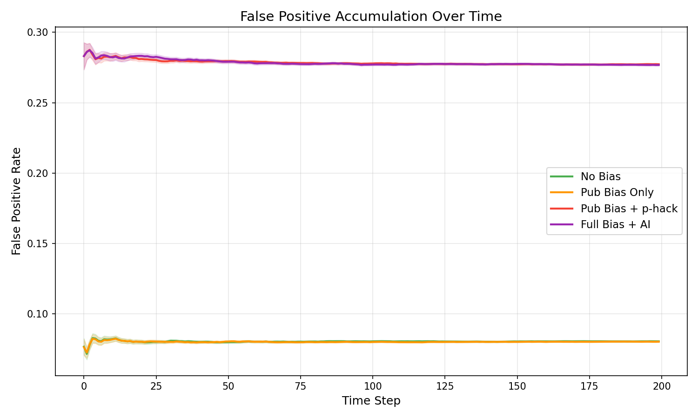
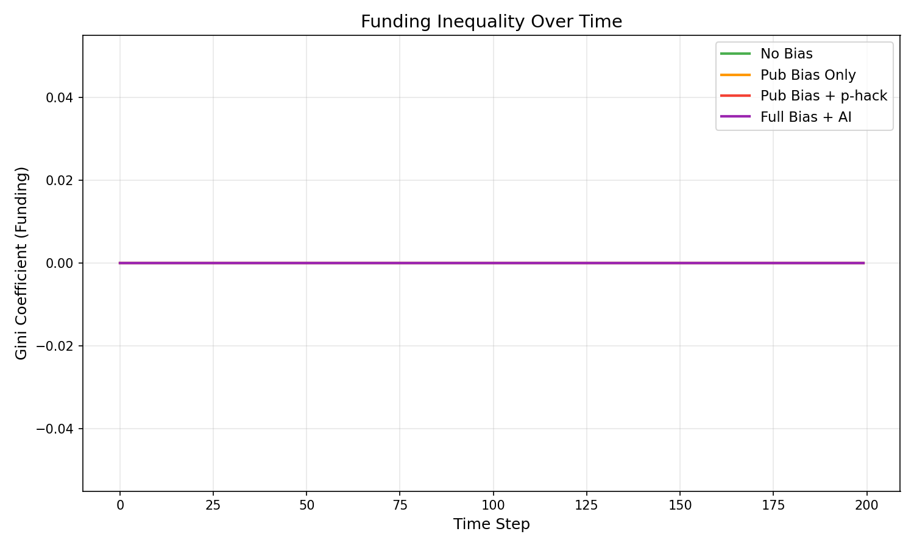

# MS1: 出版バイアスと偽陽性蓄積

## 仮説

> 出版バイアス（ポジティブな結果が優先的に掲載される）は偽陽性を蓄積させ、科学知識の真実含有率を低下させる。p-hackingがこれを加速し、AI最適化ラボはさらに増幅する。

## 実験設計

50のラボが200タイムステップにわたって論文を生産し、共有の出版チャネルに投稿する。出版チャネルはバイアス設定可能で、4つの条件を比較する。

### 4つの条件

| 条件 | 出版バイアス | p-hacking | AI比率 | 査読品質 |
|------|-------------|-----------|--------|---------|
| **No Bias** | なし | なし | 0% | 0.7 |
| **Pub Bias Only** | positive=0.4, novelty=0.3 | なし | 0% | 0.5 |
| **Pub Bias + p-hack** | positive=0.4, novelty=0.3 | intensity=0.5 | 0% | 0.5 |
| **Full Bias + AI** | positive=0.4, novelty=0.3 | intensity=0.5 | 50% | 0.5 |

### 主要メカニクス

**論文生成**: パイプライン出力が閾値を超えるとPaperオブジェクトを生成
- `is_true`: Bernoulli(base_truth_rate=0.5) で決定（品質非依存）
- `effect_size`: 真の発見 → |N(0.4, 0.2)|、偽の発見 → |N(0.05, 0.1)|

**p-hacking**: reputation低下時にreported_effectを水増し
- 偽の発見が特に大きく水増しされる（選択的報告のモデル化）

**出版審査**: `score = quality + |reported_effect| × positive_bias + novelty × novelty_bias - detection_penalty`

## 結果 (N=100 seeds)

```
Condition                     Truth Ratio          FPR   Total Pubs
────────────────────────────────────────────────────────────────────
No Bias                   0.500 ± 0.001        0.081         8919
Pub Bias Only             0.502 ± 0.001        0.080         9531
Pub Bias + p-hack         0.501 ± 0.001        0.277         9550
Full Bias + AI            0.501 ± 0.001        0.277         9695
```

### 主要メトリクス

- **Truth Ratio**: 出版論文中の「真の発見」の割合（全条件で ~0.50）
- **False Positive Rate (FPR)**: 正の効果を報告する論文中の偽陽性率
- **Total Pubs**: 200ステップでの総出版数

## 可視化

### Truth Ratio推移


### 出版量 vs 真実率


### 偽陽性蓄積


### 資金不平等


### AI比率推移


### 条件別箱ひげ図


## 分析

### 1. p-hackingが偽陽性率を3.4倍に

No BiasのFPR 0.081に対し、p-hacking条件では0.277と3.4倍に増加。これはIoannidis (2005) の「ほとんどの研究結果は偽である」という主張のメカニズムを再現している。

### 2. Truth Ratioは安定的だがFPRに差

Truth Ratio自体は全条件で~0.50と安定。base_truth_rate=0.5を反映。しかし、**ポジティブな結果を報告する論文に限定**すると偽陽性が大幅に増加。これは現実の科学文献でも観察されるパターン — 全体の統計では見えにくい問題がpositive-reporting paperに集中。

### 3. AI加速は出版量を増やすが品質は変えない

Full Bias + AI条件は出版量を+1.5%増やすが（9550→9695）、FPRや Truth Ratioはp-hack条件と同等。AIは「生産性のパラドックス」 — 出力を増やすが、バイアスのある出版システムではノイズも比例して増加。

### 4. 出版バイアス単独の影響は限定的

Pub Bias OnlyのFPR(0.080)はNo Bias(0.081)とほぼ同等。出版バイアスは「ポジティブな結果を選好する」が、p-hackingなしでは真の発見も同様に正のeffect_sizeを持つため、バイアスが差別的に偽陽性を通すわけではない。**p-hackingとの組み合わせ**で初めて問題が深刻化する。

## パラメータ

| パラメータ | 値 |
|-----------|-----|
| ラボ数 | 50 |
| タイムステップ | 200 |
| Monte Carlo seeds | 100 |
| base_truth_rate | 0.5 |
| paper_threshold | 0.3 |
| funding_cycle | 20 |

## ソースコード

- 実験スクリプト: [`poc/src/run_ms1_publication_bias.py`](../poc/src/run_ms1_publication_bias.py)
- エコシステム: [`poc/src/meta_science_ecosystem.py`](../poc/src/meta_science_ecosystem.py)
- モデル: [`poc/src/meta_science_models.py`](../poc/src/meta_science_models.py)
