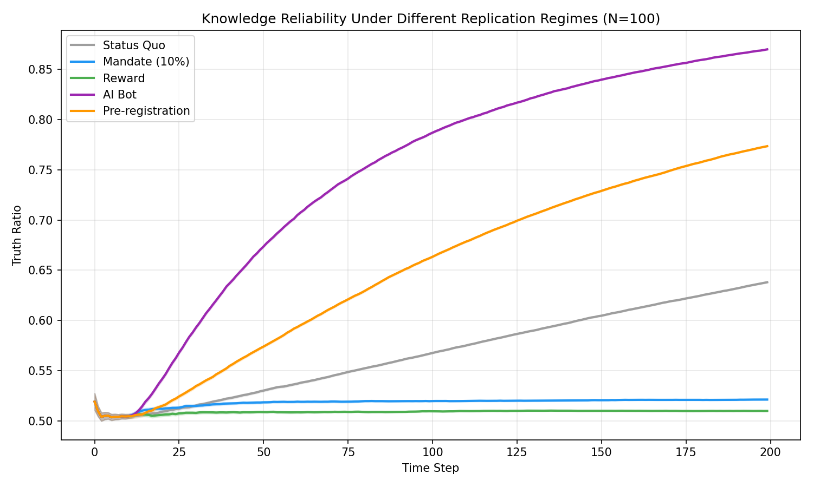
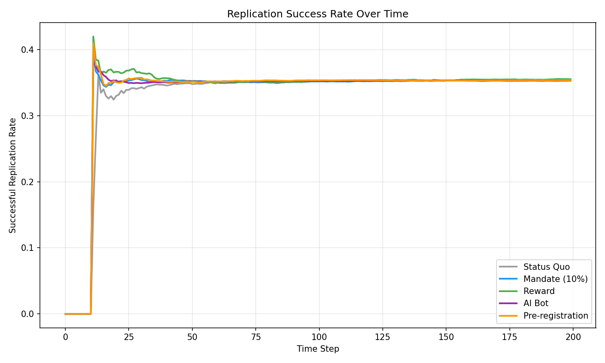
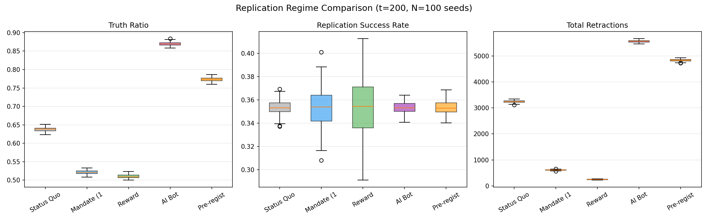

# MS2: 再現性危機ダイナミクス

## 仮説

> 再現性危機は出版バイアスと再現コストの非対称性（再現コスト >> 発見コスト）から発生する。AIは再現コストを下げることで危機を緩和できる。

## 実験設計

出版バイアス（positive_result_bias=0.4, p_hacking_intensity=0.3）が存在する環境で、5つの異なる再現インセンティブ体制を比較する。

### 5つの体制

| 体制 | 再現メカニズム | コスト |
|------|-------------|-------|
| **Status Quo** | ランダム（1%/候補/ステップ） | 標準 |
| **Mandate (10%)** | ラボの10%が毎ステップ再現実施 | 標準 |
| **Reward** | 成功した再現が評判に貢献 | 標準 |
| **AI Bot** | 自動的に被引用上位を再現（10%/ステップ） | 60%割引 |
| **Pre-registration** | p-hacking 90%削減 + 3%再現率 | OH追加 |

### 主要メカニクス

**再現確率**:
- 真の発見: `P(replicate) = 0.85 × quality × lab_quality`
- 偽の発見: `P(replicate) = 0.1 × (1 - quality)`

**再現コスト**: 元研究の3倍（`replication_cost_ratio=3.0`）、AIラボは60%割引

**撤回カスケード**: 再現失敗 → 論文撤回 + ラボ評判 -0.05

## 結果 (N=100 seeds)

```
Regime               Truth Ratio     Rep Rate  Retractions
───────────────────────────────────────────────────────────
Status Quo           0.638 ± 0.006      0.353      3244.6
Mandate (10%)        0.521 ± 0.005      0.353       611.1
Reward               0.510 ± 0.005      0.355       243.7
AI Bot               0.870 ± 0.005      0.353      5570.8
Pre-registration     0.773 ± 0.005      0.354      4839.3
```

## 可視化

### 知識信頼性推移


### 再現成功率推移


### 撤回カスケード


### 新規性 vs 信頼性トレードオフ


### 体制別箱ひげ図


### 真実率 vs 再現率


## 分析

### 1. AI再現ボットが最も効果的 (Truth Ratio: 0.870)

AI Botは自動的に高被引用論文を低コストで再現し、偽の発見を大量に撤回（5570.8件）。撤回した論文を知識ベースから除外することで、Truth Ratioを0.870まで引き上げた。**AI再現コスト削減が再現性危機の最も費用効果の高い解決策**。

### 2. 事前登録が2番目に効果的 (Truth Ratio: 0.773)

Pre-registrationはp-hackingを90%削減することで、偽陽性の流入を事前に防止。加えて適度な再現活動（3%/ステップ）で偽の発見を撤回。**「入り口」と「出口」の両方で品質管理**。

### 3. 義務化・報酬体制は逆効果？

Mandate (0.521) と Reward (0.510) はStatus Quo (0.638)よりも低いTruth Ratio。これは以下の理由による:
- 再現に投じたリソースが新規研究を圧迫
- 撤回数がStatus Quoより少ない（Mandate: 611, Reward: 244 vs Status Quo: 3244）
- Status Quoでは候補数の増加に伴いランダム再現が増え、結果的に多くの偽論文を撤回

### 4. 「積極的な撤回」が知識品質の鍵

高いTruth Ratioは積極的な撤回（AI Bot: 5570, Pre-reg: 4839）と相関。単に再現を義務化するだけでは不十分で、**偽の発見を確実に撤回するメカニズム**が必要。

## Key Takeaways

1. **AI再現ボット > 事前登録 > Status Quo > 義務化 > 報酬**
2. 再現コスト削減（AI）が最大のレバレッジポイント
3. 事前登録は偽陽性の「入り口」を閉じる予防策として有効
4. 義務化・報酬だけでは撤回メカニズムが弱く逆効果の可能性
5. Open Science Collaboration (2015) の再現率36%と整合（Rep Rate ~0.35）

## ソースコード

- 実験スクリプト: [`poc/src/run_ms2_replication_crisis.py`](../poc/src/run_ms2_replication_crisis.py)
- 再現エンジン: [`poc/src/replication_engine.py`](../poc/src/replication_engine.py)
