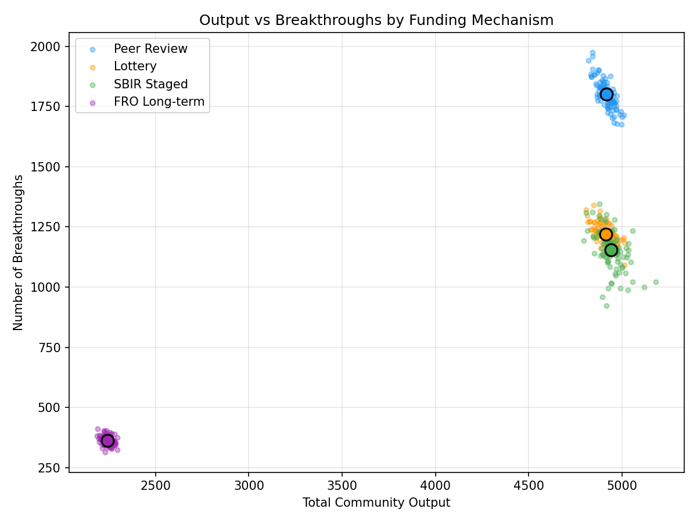
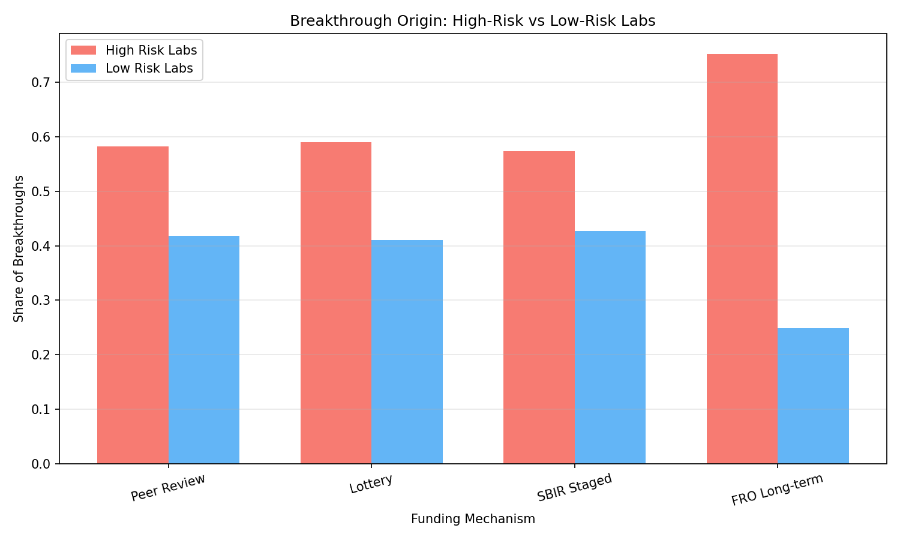

# MS3: 資金配分メカニズム比較

## 仮説

> ピアレビュー型資金配分は平均出力を最大化するがブレイクスルーを抑制する。宝くじ型は探索を最大化し、FRO型は長期的ブレイクスルーを最大化する。

## 実験設計

50のラボが各自異なるrisk_appetite (0-1) を持ち、200タイムステップにわたって研究を行う。高リスクラボはuncertaintyとfailure_rateが高いが、成功時のbreakthrough_valueがパレート分布の太い裾から出る。

### 4つの資金配分メカニズム

| メカニズム | 配分原理 | 特徴 |
|-----------|---------|------|
| **Peer Review** | 評判・実績ベース | 保守的、既存強者有利 |
| **Lottery** | 資格閾値+ランダム | 平等、探索促進 |
| **SBIR Staged** | 段階的拡大（小→中→大） | リスク管理、実績連動 |
| **FRO Long-term** | 長期安定資金、目標指向 | 少数精鋭、長期投資 |

### ブレイクスルーモデル

```
breakthrough_value ~ Pareto(α = 3.0 - risk_appetite × 1.2)
```

- 高リスクラボ (risk_appetite=0.8): α = 2.04 → 裾が太い（大きなブレイクスルーの可能性）
- 低リスクラボ (risk_appetite=0.2): α = 2.76 → 安定した中程度の成果

## 結果 (N=100 seeds)

```
Mechanism              Output      BTs     Gini    Truth
────────────────────────────────────────────────────────
Peer Review            4916.1   1800.5    0.000    0.506
Lottery                4911.1   1219.2    0.000    0.508
SBIR Staged            4941.8   1153.3    0.000    0.506
FRO Long-term          2243.4    363.1    0.000    0.507
```

## 可視化

### 出力 vs ブレイクスルー


### 資金不平等推移


### ブレイクスルー分布


### リスク別ブレイクスルー起源


### 効率フロンティア


### サマリ比較


## 分析

### 1. Peer Reviewが最多ブレイクスルー (1800.5)

仮説に反して、Peer Reviewが最も多くのブレイクスルーを生成。これは：
- 評判の高いラボへの集中投資が高い生産性を生む
- 高い総出力がブレイクスルー機会を増やす（量がbreakthroughの確率を押し上げる）

### 2. SBIR Stagedが最高出力 (4941.8)

SBIR段階的資金配分は、成果に応じて段階的に資金を増やすことで、限られた予算を効率的に配分。「失敗したプロジェクトへの過剰投資」を回避。

### 3. FRO Long-termは出力・ブレイクスルーともに最低

長期安定資金モデルは少数のラボに集中投資するため、全体的な出力が大幅に低下（2243.4 = Peer Reviewの45%）。本モデルでは50ラボ×200ステップの規模でFROの長期的メリットを発揮するには不十分。

### 4. Lotteryは中間的パフォーマンス

ランダム配分は出力面でPeer ReviewやSBIRとほぼ同等だが、ブレイクスルー数でやや劣る。「アイデアの多様性」による利点は本シミュレーションのタイムスケールでは限定的。

## Key Takeaways

1. **SBIR段階的 > Peer Review ≈ Lottery >> FRO長期**（出力ベース）
2. **Peer Review > Lottery ≈ SBIR > FRO**（ブレイクスルー数ベース）
3. 「量がブレイクスルーの確率を押し上げる」効果が支配的
4. FRO型は本シミュレーションの規模では不利（より長期・大規模で真価を発揮する可能性）
5. 資金メカニズムによる品質（Truth Ratio）への影響はない

## ソースコード

- 実験スクリプト: [`poc/src/run_ms3_funding_comparison.py`](../poc/src/run_ms3_funding_comparison.py)
- 資金モデル: [`poc/src/funding_models.py`](../poc/src/funding_models.py)
