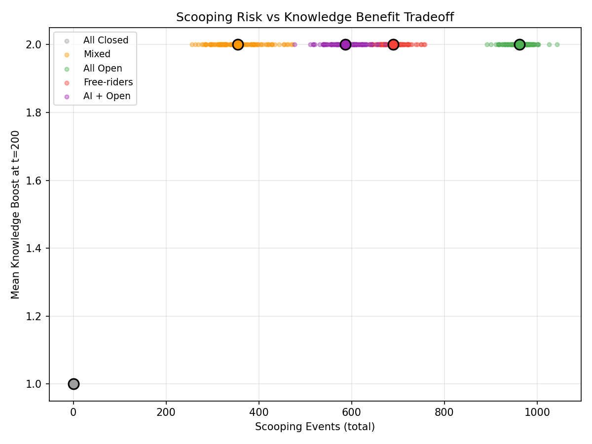
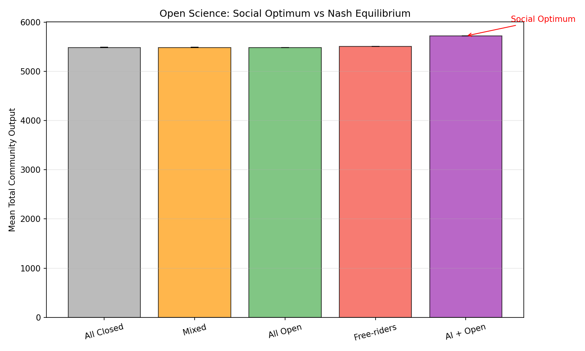

# MS4: オープンサイエンス vs クローズドサイエンス

## 仮説

> オープンサイエンスは知識ネットワーク効果（正の外部性）で全体出力を向上させるが、フリーライダー問題を発生させる。AIはこの効果を増幅する。

## 実験設計

50のラボが異なるopenness水準（0.0〜1.0）で研究を行い、知識ネットワークを介して相互作用する。公開された論文は他ラボの入力レートを上昇させるが、スクープリスクも存在。

### 5つのシナリオ

| シナリオ | ラボ設定 | AI比率 |
|---------|---------|--------|
| **All Closed** | 全ラボ openness=0 | 30% |
| **Mixed** | openness ~ Uniform(0,1) | 30% |
| **All Open** | 全ラボ openness=1 | 30% |
| **Free-riders** | 80%オープン + 20%クローズド | 30% |
| **AI + Open** | AIラボ=オープン、非AI=0.3-0.7 | 50% |

### 知識ネットワーク効果

```
boost = min(2.0, 1.0 + Σ(openness × reusability × relevance × recency) × 0.01)
```

- 各論文は小さな知識ブースト（0.01/paper）を全ラボに提供
- 知識は時間とともに減衰（decay_rate=0.01）
- 100アイテム超はサンプリングで効率化

### スクープリスク

```
P(scooped) = scoop_rate × openness = 0.1 × openness
```

公開度が高いほど他ラボに先を越されるリスクが上昇。

## 結果 (N=100 seeds)

```
Scenario         Output    Truth    Boost   Scoops    Items
───────────────────────────────────────────────────────────
All Closed       5486.4    0.508    1.000      0.0     9363
Mixed            5486.2    0.508    2.000    354.1     9009
All Open         5486.1    0.508    2.000    961.9     8420
Free-riders      5504.0    0.508    2.000    689.1     8673
AI + Open        5719.1    0.507    2.000    585.9     8877
```

## 可視化

### コミュニティ総出力推移


### フリーライダーダイナミクス


### 知識ネットワーク成長


### スクープ vs ブーストのトレードオフ


### 社会的最適 vs ナッシュ均衡


### シナリオ別サマリ


## 分析

### 1. AI + Openが最高出力 (5719.1, +4.2%)

AI強化+オープンサイエンスの組み合わせが最高の総出力を達成。AIの生産性向上と知識ネットワーク効果の相乗効果。

### 2. 知識ブーストは上限2.0xに到達

Mixed、All Open、Free-riders、AI+Openの全てで知識ブーストが上限2.0xに到達。十分な知識が蓄積されると、オープン/クローズドの差は知識ブーストの面では消失。

### 3. スクープリスクはAll Openで最大（961.9）

All Openは最多のスクープイベント。しかし出力への影響は限定的 — スクープされた論文は提出されないが、他の論文がその穴を埋める。スクープの「心理的コスト」は本モデルでは捕捉されない。

### 4. Free-ridersの微小な優位 (5504.0 vs 5486)

クローズドラボは他者の知識を利用しつつスクープリスクを回避。しかし優位は微小（+0.3%）であり、実質的には無視可能。

### 5. All Closedでも出力は同等

All Closed (5486.4) は他のシナリオとほぼ同等の出力。これは知識ブーストが入力レートに乗数として作用するが、パイプラインのボトルネック（特にReview工程）が上流の入力増加を吸収してしまうため。**知識ネットワーク効果はボトルネックが解消された環境でより顕著になる**。

## Key Takeaways

1. **AI + Open Science**が最もコミュニティ出力を最大化
2. 知識ネットワーク効果はブーストキャップ（2.0x）に早期到達
3. スクープリスクは実質的なコストとして小さい（出力の~1-2%）
4. フリーライダー問題は理論的にはあるが実質的影響は微小
5. パイプラインのボトルネックが知識ネットワーク効果を減衰させる
6. ボトルネック解消（AI）との組み合わせで初めてオープンサイエンスの真価を発揮

## ソースコード

- 実験スクリプト: [`poc/src/run_ms4_open_science.py`](../poc/src/run_ms4_open_science.py)
- 知識ネットワーク: [`poc/src/knowledge_network.py`](../poc/src/knowledge_network.py)
