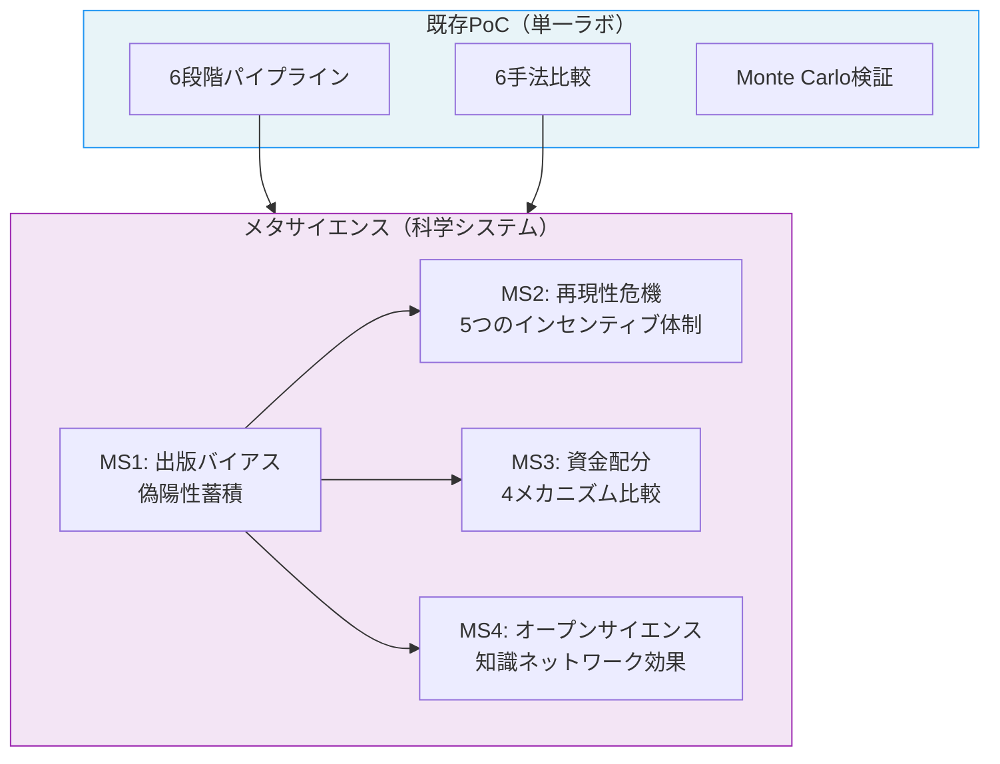
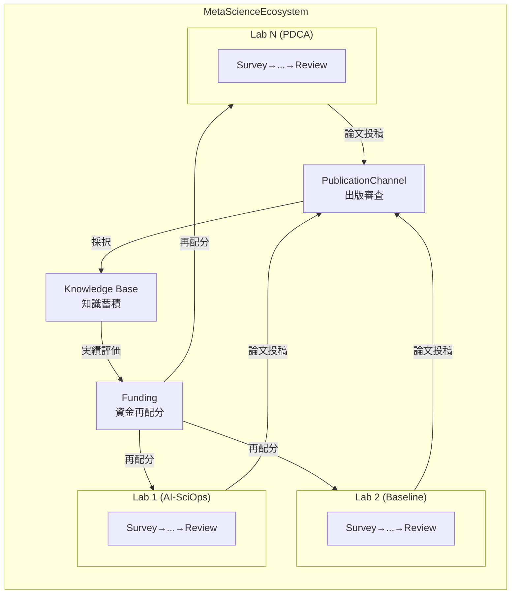

# メタサイエンス・シミュレーション実験

## 概要

既存のDeSciTokyo PoCは**単一ラボ**の6段階パイプライン最適化をシミュレーションしていた。メタサイエンス実験群は、これを**科学システム全体**レベルに拡張し、複数ラボの集団行動・出版バイアス・再現性危機・資金配分・オープンサイエンスなどの科学制度的課題をシミュレーションする。

### メタサイエンスとは

メタサイエンスは「科学についての科学」 — 科学研究のプロセスや制度自体を研究対象とする分野である。近年、再現性危機（Ioannidis 2005）、出版バイアス、p-hacking等の問題が注目され、科学システムの構造的改善が求められている。

### 実験の全体像



## アーキテクチャ

### マルチラボ・エコシステム

全実験は共通の`MetaScienceEcosystem`フレームワーク上で動作する。



### 主要クラス

| クラス | ファイル | 役割 |
|--------|---------|------|
| `Paper` | `meta_science_models.py` | 研究成果物（品質、効果量、真偽） |
| `LabState` | `meta_science_ecosystem.py` | ラボの状態（パイプライン、評判、資金） |
| `PublicationChannel` | `meta_science_models.py` | 出版審査（バイアス設定可能） |
| `MetaScienceEcosystem` | `meta_science_ecosystem.py` | マルチラボ・シミュレーター |
| `ReplicationEngine` | `replication_engine.py` | 再現実験メカニクス |
| `KnowledgeNetwork` | `knowledge_network.py` | 知識ネットワーク効果 |
| `FundingAllocator` | `funding_models.py` | 資金配分メカニズム |

### 共通パラメータ

| パラメータ | デフォルト値 | 説明 |
|-----------|-------------|------|
| ラボ数 | 50 | シミュレーション内のラボ数 |
| タイムステップ | 200 | 各実験の時間ステップ |
| Monte Carlo seeds | 100 | 統計検証用の乱数シード数 |
| 基本資金 | 6.0/lab | 各ラボの初期リソース量 |
| 入力レート | 2.0 | 各ラボのパイプライン入力 |
| 基準真実率 | 0.5 | 発見が真である確率 |

## 4つの実験

### [MS1: 出版バイアスと偽陽性蓄積](./Meta-Science-MS1.md)

**仮説**: 出版バイアスは偽陽性を蓄積させ、p-hackingがこれを加速する

4条件比較: バイアスなし → 出版バイアス → +p-hacking → +AI加速

### [MS2: 再現性危機ダイナミクス](./Meta-Science-MS2.md)

**仮説**: 再現性危機は出版バイアスと再現コスト非対称性から発生し、AIは再現コスト削減で緩和できる

5体制比較: 現状維持 / 再現義務化 / 再現報酬 / AI再現ボット / 事前登録

### [MS3: 資金配分メカニズム比較](./Meta-Science-MS3.md)

**仮説**: ピアレビュー型は平均出力最大化、宝くじ型は探索最大化、FRO型は長期ブレイクスルー最大化

4メカニズム比較: ピアレビュー / 宝くじ / SBIR段階 / FRO長期

### [MS4: オープンサイエンス vs クローズド](./Meta-Science-MS4.md)

**仮説**: オープンサイエンスは知識ネットワーク効果で全体出力を向上させるが、フリーライダー問題が発生する

5シナリオ: 全クローズド / 混合 / 全オープン / フリーライダー / AI+オープン

## クイックスタート

```bash
cd poc/src
pip install matplotlib numpy

# 実験1: 出版バイアス
python run_ms1_publication_bias.py

# 実験2: 再現性危機
python run_ms2_replication_crisis.py

# 実験3: 資金配分
python run_ms3_funding_comparison.py

# 実験4: オープンサイエンス
python run_ms4_open_science.py
```

## ソースコード

| ファイル | 説明 |
|---------|------|
| `poc/src/meta_science_models.py` | 共通データクラス |
| `poc/src/meta_science_ecosystem.py` | マルチラボ・シミュレーター |
| `poc/src/replication_engine.py` | 再現実験エンジン |
| `poc/src/knowledge_network.py` | 知識ネットワーク |
| `poc/src/funding_models.py` | 資金配分モデル |
| `poc/src/run_ms1_publication_bias.py` | 実験1スクリプト |
| `poc/src/run_ms2_replication_crisis.py` | 実験2スクリプト |
| `poc/src/run_ms3_funding_comparison.py` | 実験3スクリプト |
| `poc/src/run_ms4_open_science.py` | 実験4スクリプト |
