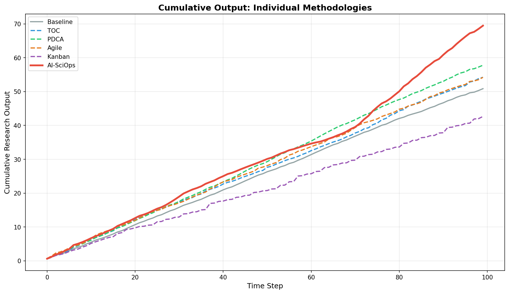
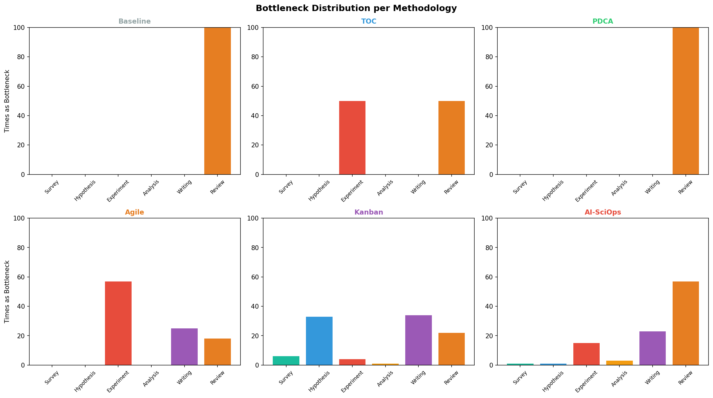

# Individual Methodology Comparison (v6)

## Overview

This experiment isolates each process management methodology and runs it **independently** against the same 6-stage scientific research pipeline. Unlike previous experiments that combined methods (e.g., TOC+PDCA), each methodology here operates in its pure form.

### Key Question
> How does each management framework perform on its own, without AI enhancement, compared to the AI-SciOps approach?

## Methodologies Tested

| # | Methodology | AI? | Core Mechanism |
|---|-----------|-----|---------------|
| 1 | **Baseline** | No | Equal resource distribution, no optimization |
| 2 | **TOC** (Theory of Constraints) | No | Identify bottleneck → Exploit → Subordinate → Elevate → Repeat |
| 3 | **PDCA** (Plan-Do-Check-Act) | No | Deming cycle: analyze → target weak processes → measure → standardize |
| 4 | **Agile** (Sprint-based) | No | 8-step sprints, velocity tracking, retrospectives, mid-sprint adjustment |
| 5 | **Kanban** (Pull-based Flow) | No | WIP limits, pull-based resource allocation, dynamic limit adjustment |
| 6 | **AI-SciOps** | Yes | 4-stage AI-driven: assist → autonomize → prune → meta-optimize |

## Results Summary

```
Methodology                    Output    vs Baseline
─────────────────────────────────────────────────────
AI-SciOps                      69.48     +36.6%  ***
PDCA                           57.79     +13.6%
TOC                            54.23      +6.6%
Agile                          54.22      +6.6%
Baseline                       50.86       base
Kanban                         42.66     -16.1%
```

### Ranking Chart


## Analysis

### 1. AI-SciOps dominates (+36.6%)

AI-SciOps achieves dramatically higher output than any non-AI method. The key advantages:
- **AI automation boost**: throughput multiplied by AI assistance (up to 2x for highly automatable processes)
- **Process pruning** (Stage 3): uncertainty reduction for AI-automated processes
- **Meta-optimization** (Stage 4): parallelization of Survey+Hypothesis, human review reduction

### 2. PDCA is the best non-AI method (+13.6%)

PDCA's continuous improvement cycle works well because:
- **Systematic targeting**: focuses resources on the 3 weakest processes each cycle
- **Cumulative improvement**: every 3 cycles, uncertainty reduction compounds
- **Balanced approach**: doesn't over-concentrate resources on one bottleneck

### 3. TOC and Agile tie (+6.6%)

Both achieve the same total output but through different mechanisms:
- **TOC**: concentrates 35% of resources on the bottleneck (Experiment/Review), improving flow through the constraint
- **Agile**: sprints focus on 2 weakest processes, with mid-sprint adjustment for responsiveness

### 4. Kanban underperforms alone (-16.1%)

Pure Kanban without AI assistance actually hurts performance because:
- **WIP limits throttle flow**: without AI to increase throughput, WIP limits just slow everything down
- **Pull-based allocation creates imbalance**: some processes get too few resources
- **No process improvement mechanism**: Kanban manages flow but doesn't improve process quality

## Cumulative Output Over Time



Key observations:
- AI-SciOps pulls ahead starting around step 20 (Stage 2: autonomous optimization)
- The gap widens dramatically after step 50 (Stage 3: process pruning + AI near-maximum)
- PDCA's advantage over TOC/Agile emerges gradually through cumulative improvements
- Kanban starts falling behind around step 30 as WIP limits constrain flow

## Bottleneck Analysis



Each methodology handles bottlenecks differently:

| Methodology | Primary Bottleneck | Pattern |
|------------|-------------------|---------|
| **Baseline** | Review (100%) | Never addressed — Review's low throughput (0.6) always limits the system |
| **TOC** | Experiment (50%) + Review (50%) | TOC moves resources to Review, then Experiment becomes the new constraint |
| **PDCA** | Review (100%) | PDCA improves quality but doesn't shift Review's fundamental throughput |
| **Agile** | Experiment (57%) | Sprint focus on bottleneck shifts constraint to Experiment |
| **Kanban** | Writing (34%) + Hypothesis (33%) | WIP limits create new bottlenecks in unexpected places |
| **AI-SciOps** | Review (57%) + Writing (23%) | AI resolves most bottlenecks; Review persists due to human review requirement |

## Radar Comparison


Multi-dimensional comparison across 6 axes:
- **Total Output**: AI-SciOps >> PDCA > TOC = Agile > Baseline > Kanban
- **Avg Throughput**: Same ranking as output
- **Low Rework**: Agile and PDCA have the lowest rework (fewer corrections needed)
- **Low Failures**: Agile leads (focused sprints catch issues early)
- **Bottleneck Resolution**: Kanban distributes bottlenecks most evenly (but at cost of output)
- **Flow Efficiency**: PDCA achieves the smoothest throughput over time

## System Throughput Over Time


## Summary Metrics


## WIP Heatmaps


## Key Takeaways

1. **AI is the differentiator**: Non-AI methods improve output by 6-14%, while AI-SciOps achieves +37%. The human-AI coordination (process restructuring, automated review) is what creates the gap.

2. **PDCA > TOC for research pipelines**: PDCA's systematic improvement cycle compounds over time, outperforming TOC's bottleneck-focused approach in research contexts where quality (uncertainty/failure reduction) matters more than raw throughput.

3. **Agile = TOC in outcome, different mechanism**: Both achieve the same output, suggesting that sprint-based management and constraint-based management are equivalent for simple serial pipelines.

4. **Pure Kanban hurts without AI**: WIP limits are counterproductive when the system lacks the AI throughput boost to actually utilize the controlled flow. Kanban needs a throughput-enhancement mechanism to be effective.

5. **No single non-AI method solves Review bottleneck**: The Review process (throughput=0.6, human_review_needed=0.8) is the persistent bottleneck that only AI can address through automated meta-review.

## Experiment Parameters

| Parameter | Value |
|-----------|-------|
| Time steps | 100 |
| Total resources | 6.0 |
| Input rate | 2.0 |
| Random seed | 42 |
| Pipeline | Survey → Hypothesis → Experiment → Analysis → Writing → Review |

## Source Code

- Optimizer implementations: [`poc/src/individual_optimizers.py`](../poc/src/individual_optimizers.py)
- Experiment runner: [`poc/src/run_methodology_comparison.py`](../poc/src/run_methodology_comparison.py)
