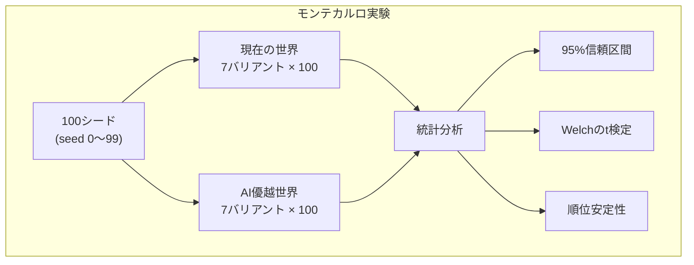
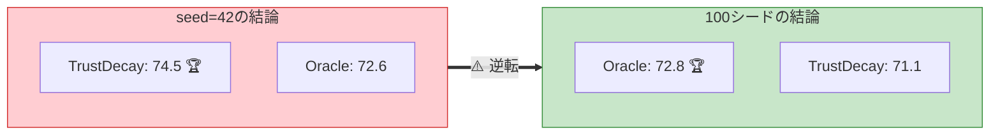
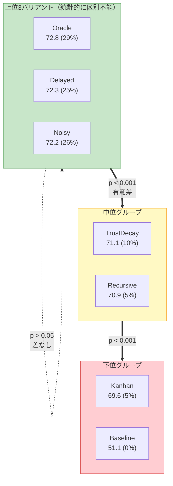
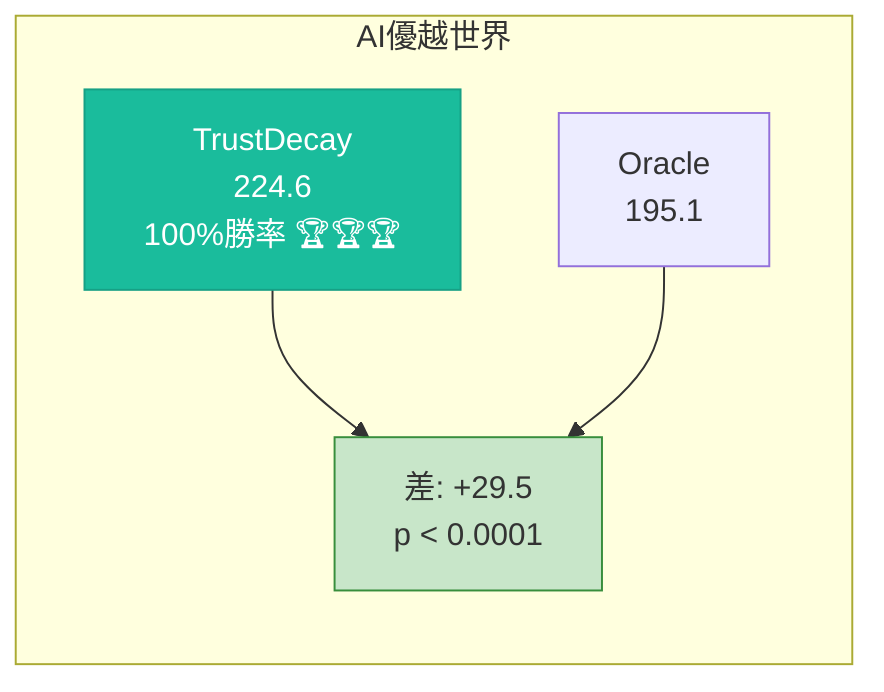
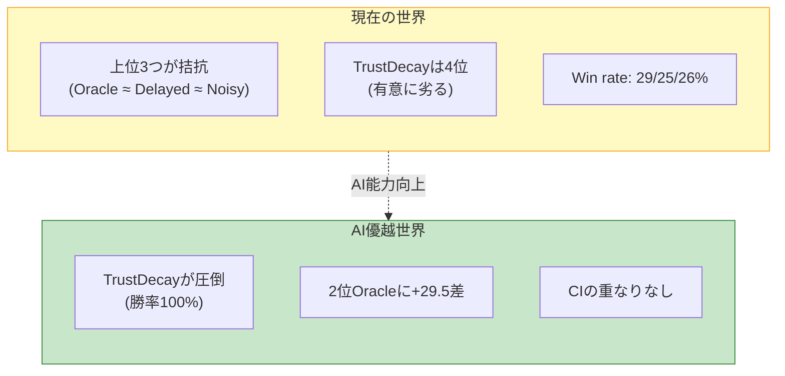
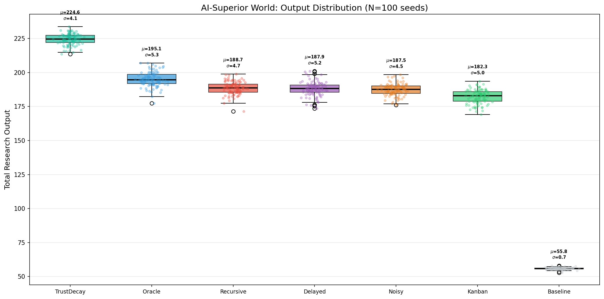
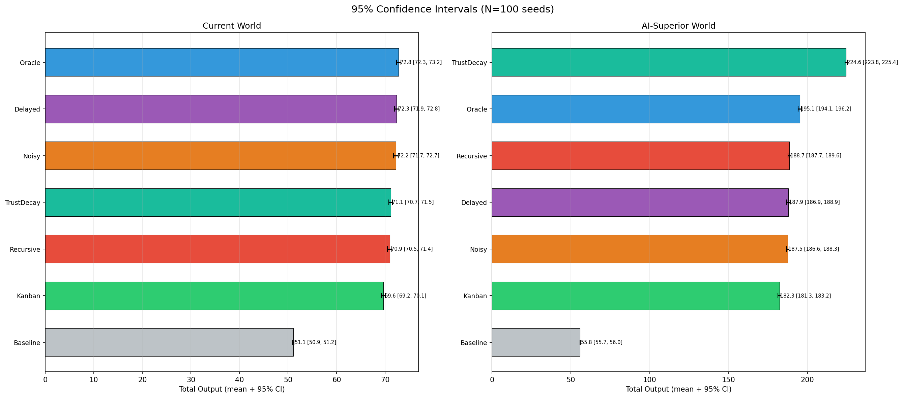
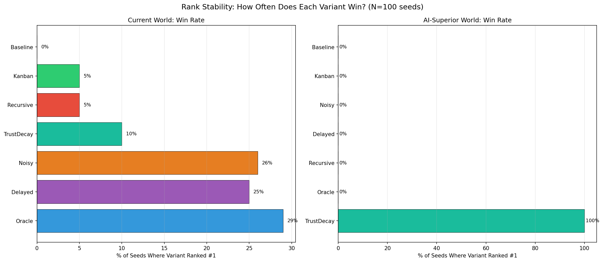

# モンテカルロ実験: 統計的検証

## 背景

これまでの実験は全て単一の乱数シード（seed=42）で実行されていた。シミュレーション内の不確実性（rework判定）や失敗（failure判定）はランダムに決まるため、特定のシード依存で結論が変わる可能性があった。

本実験では**100個の異なるシード**（seed 0〜99）で全バリアントを実行し、結果の統計的ロバスト性を検証した。

## 実験設計

- 現在の世界: 7バリアント × 100シード = **700回**
- AI優越世界: 7バリアント × 100シード = **700回**
- 合計: **1,400回**のシミュレーション

## 結果: 現在の世界

### 単一シードの結論は覆った

**seed=42ではTrustDecayが最良（74.5）だったが、100シードの平均ではOracleが最良（72.8）であり、TrustDecayは統計的に有意に劣っていた（p < 0.001）。**

### 記述統計

| バリアント | 平均 | 標準偏差 | CV(%) | 95% 信頼区間 | 最小 | 最大 | 1位率 |
|---|---|---|---|---|---|---|---|
| **Oracle** | **72.8** | 2.2 | 3.0 | [72.3, 73.2] | 69.3 | 81.1 | **29%** |
| Delayed | 72.3 | 2.3 | 3.1 | [71.9, 72.8] | 67.4 | 81.2 | 25% |
| Noisy | 72.2 | 2.5 | 3.5 | [71.7, 72.7] | 67.8 | 78.8 | 26% |
| TrustDecay | 71.1 | 2.0 | 2.8 | [70.7, 71.5] | 67.6 | 77.9 | 10% |
| Recursive | 70.9 | 2.3 | 3.3 | [70.5, 71.4] | 66.5 | 77.7 | 5% |
| Kanban | 69.6 | 2.2 | 3.2 | [69.2, 70.1] | 64.4 | 75.9 | 5% |
| Baseline | 51.1 | 0.8 | 1.5 | [50.9, 51.2] | 48.9 | 53.0 | 0% |

### 統計的検定（vs Oracle）

| バリアント | 平均差 | t統計量 | p値 | 有意(5%) | 有意(1%) |
|---|---|---|---|---|---|
| Delayed | -0.42 | -1.32 | 0.188 | No | No |
| Noisy | -0.56 | -1.66 | 0.097 | No | No |
| **TrustDecay** | **-1.65** | **-5.54** | **0.000** | **Yes** | **Yes** |
| **Recursive** | **-1.83** | **-5.70** | **0.000** | **Yes** | **Yes** |
| **Kanban** | **-3.14** | **-9.98** | **0.000** | **Yes** | **Yes** |

### 重要な発見

1. **上位3バリアント（Oracle、Delayed、Noisy）は統計的に区別できない**（p > 0.05）。勝率も29%/25%/26%で拮抗。
2. **TrustDecayの「最良」は seed=42 の偶然だった**。100シードではOracleに対して有意に劣る（p < 0.001）。
3. **Baselineの分散が最小**（CV=1.5%）。最適化なしが最も安定だが、出力は最低。

## 結果: AI優越世界

### TrustDecayの圧倒的優位は統計的に確実

| バリアント | 平均 | 標準偏差 | CV(%) | 95% 信頼区間 | 1位率 |
|---|---|---|---|---|---|
| **TrustDecay** | **224.6** | 4.1 | 1.8 | [223.8, 225.4] | **100%** |
| Oracle | 195.1 | 5.3 | 2.7 | [194.1, 196.2] | 0% |
| Recursive | 188.7 | 4.7 | 2.5 | [187.7, 189.6] | 0% |
| Delayed | 187.9 | 5.2 | 2.8 | [186.9, 188.9] | 0% |
| Noisy | 187.5 | 4.5 | 2.4 | [186.6, 188.3] | 0% |
| Kanban | 182.3 | 5.0 | 2.8 | [181.3, 183.2] | 0% |
| Baseline | 55.8 | 0.7 | 1.3 | [55.7, 56.0] | 0% |

- **100シード中100シードでTrustDecayが1位**（勝率100%）
- Oracle との差 +29.5 は**統計的に極めて有意**（p < 0.0001, t=43.8）
- 95%信頼区間の重なりなし（完全に分離）

## 2つの世界の対比

| 指標 | 現在の世界 | AI優越世界 |
|---|---|---|
| 最良バリアント | Oracle（但しDelayed/Noisyと区別不能） | TrustDecay（圧倒的） |
| TrustDecayの順位 | 4位（有意に劣る） | 1位（勝率100%） |
| 上位の安定性 | 不安定（3バリアントが拮抗） | 非常に安定 |
| 結論のロバスト性 | 弱い（シード依存が大きい） | 強い（全シードで一致） |

## 修正すべき以前の結論

### 訂正1: 「TrustDecayが現在の世界で最良」は誤り

seed=42 の結果（TrustDecay: 74.5 > Oracle: 72.6）は統計的に代表的ではなかった。100シードの平均では**Oracleが最良**であり、しかも上位3バリアント（Oracle、Delayed、Noisy）は統計的に区別できないほど接近している。

### 訂正2: 「課題バリアントは全てOracleに劣る」は不正確

Delayed と Noisy は Oracle と統計的に差がない。つまり、**遅延フィードバックやノイズ観測の影響は、現在の世界では出力に対して限定的**。課題はオーバーヘッドの構成（管理OH + メタOH）に現れるが、最終出力には大きく影響しない。

### 確認: AI優越世界でのTrustDecayの優位は確実

こちらは統計的に完全に確認された。人間レビューボトルネックが消えた世界では、TrustDecayの攻撃的なコスト削減戦略が最適解になることは100シード中100シードで再現された。

## 方法論的教訓

> **単一シードのシミュレーション結果に基づく結論は危険である。**

本実験では、seed=42 だけを信じていた場合に**因果的説明を誤って構築するリスク**が示された。TrustDecayの「信頼崩壊→回復→最適バランス発見」というストーリーは魅力的だったが、統計的にはそのストーリーが常に成り立つわけではなかった。

| 方法論的教訓 | 内容 |
|---|---|
| 複数シード実行の必要性 | 単一シードでは偶然の結果を因果的に解釈してしまう |
| 信頼区間の報告 | 点推定だけでなく不確実性の範囲を示すべき |
| 統計検定の実施 | 「差がある」は目視ではなく検定で判断すべき |
| 効果量の確認 | 統計的有意性だけでなく実質的な差の大きさも重要 |

## 可視化

### 現在の世界: 出力分布

### AI優越世界: 出力分布

### 95%信頼区間の比較

### 順位安定性（勝率）

### 統計的有意性ヒートマップ

### 結果のロバスト性（変動係数）

---

### 関連ページ

- [Home](./Home.md) | [実験の詳細設計](./Experiment-Design.md) | [コードアーキテクチャ](./Architecture.md)
- [結果の詳細解釈](./Results-Analysis.md) | [論文との対応関係](./Paper-Mapping.md)
- [管理コスト自体のAI最適化](./Meta-Overhead-Analysis.md) | [AI優越世界での課題変化](./AI-Superior-World-Analysis.md)
- [ボトルネック残存世界の分析](./Bottleneck-Persists-Analysis.md) | [今後の発展](./Future-Work.md)

---

*実装: `poc/src/run_monte_carlo.py`*
*データ: `poc/results/figures_mc/monte_carlo_raw.json`*
