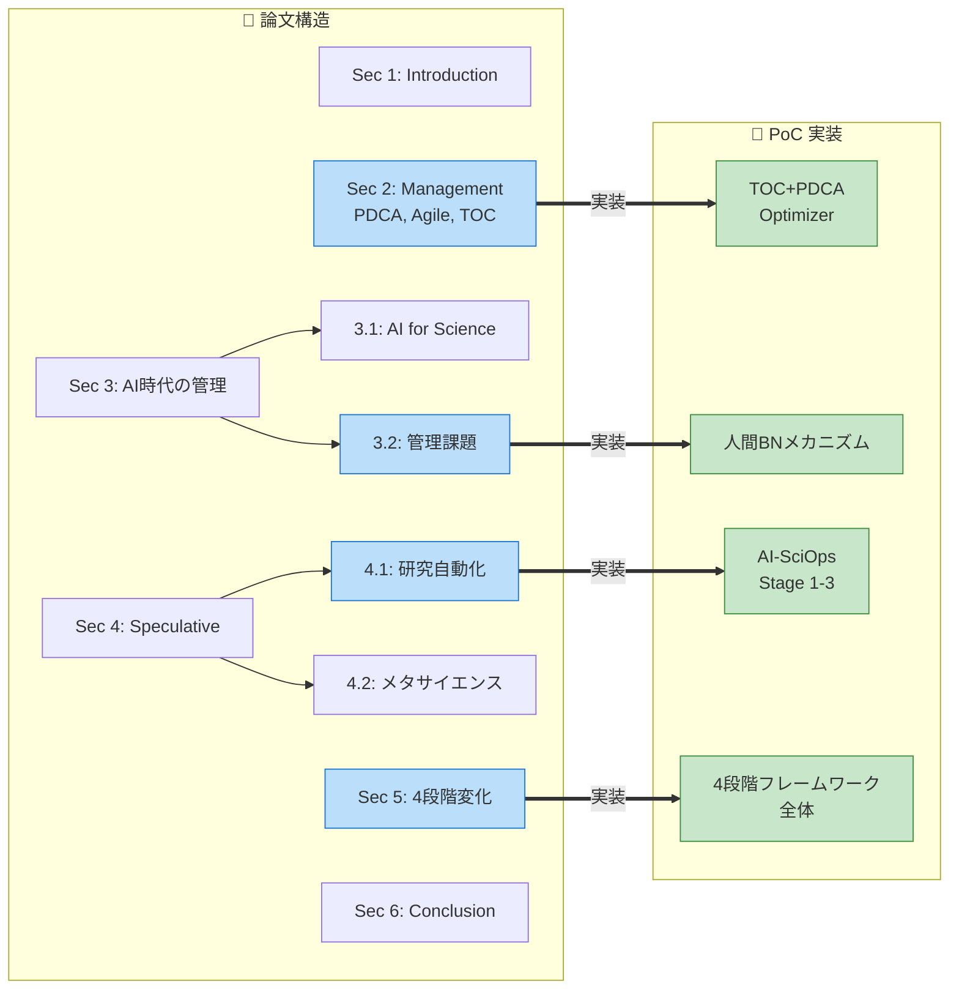
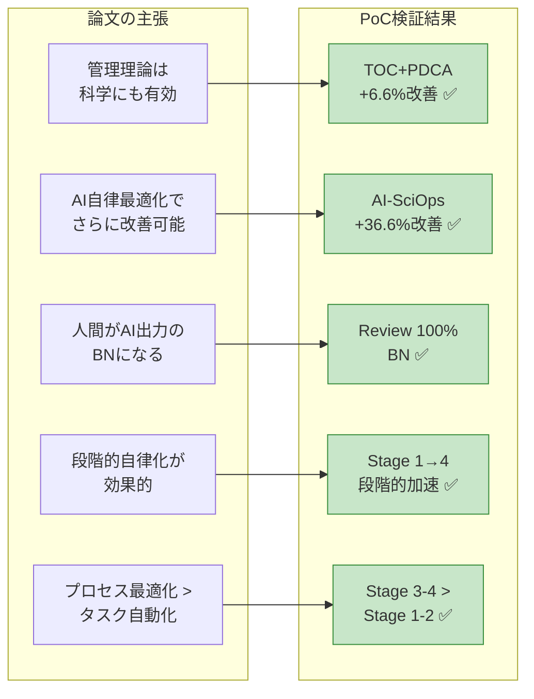

# 論文との対応関係

本ページでは、PoCシミュレーションの各要素が論文「Science in the Loop」のどの議論・概念に対応しているかを体系的に整理します。

## 1. 論文の全体構造とPoCの位置づけ



> 青色 = 論文のセクション、緑色 = PoCの実装。太矢印で対応関係を示す。

## 2. 概念レベルの対応

### 2a. 「不確実性の削減」と「ボトルネックの解消」

**論文の記述（Section 1）:**
> "To establish the process, two roles are important: reducing uncertainty and resolving bottlenecks."

**PoCでの実装:**
- **不確実性の削減** → `ProcessConfig.uncertainty` パラメータ。各タイムステップで確率的に手戻り（rework）が発生。AI支援レベルが高いほど不確実性が減少（`uncertainty * (1 - ai_assistance_level * 0.5)`）
- **ボトルネックの解消** → TOCの`get_bottleneck()`で最もスループットが低いプロセスを特定し、リソースを集中配分

### 2b. 制約理論（TOC）の5集中ステップ

**論文の記述（Section 2）:**
> "TOC, introduced by physicist Eliyahu Goldratt, offers another paradigm, positing that system performance is determined by a small number of bottlenecks."

**PoCでの実装（`TOCPDCAOptimizer`）:**

| TOCのステップ | PoCの実装 |
|-------------|----------|
| IDENTIFY | `get_bottleneck()`: effective_throughput最低のプロセスを特定 |
| EXPLOIT | ボトルネックにリソースの35%を集中 |
| SUBORDINATE | 他のプロセスは残り65%を均等配分 |
| ELEVATE | リソース集中による能力向上（間接的） |
| REPEAT | 10ステップ周期でPDCAサイクルを反復 |

### 2c. PDCA/PDSAサイクル

**論文の記述（Section 2）:**
> "It comprises four stages: (1) Plan—identify problems and develop improvement strategies; (2) Do—implement changes on a small scale; (3) Check—evaluate and analyze results; (4) Act—standardize successful practices"

**PoCでの実装:**

| PDCAフェーズ | サイクル内位置 | 動作 |
|------------|-------------|------|
| **Plan** | 0% | ボトルネック特定、改善計画の記録 |
| **Do** | 0-30% | リソース再配分を実行 |
| **Check** | 30-70% | スループット改善をモニタリング |
| **Act** | 70-100% | 改善確認→標準化、改善なし→次サイクルで修正 |

### 2d. 人間がボトルネックになる問題

**論文の記述（Section 3.2）:**
> "humans are increasingly compelled to devote more time to carefully evaluating AI-generated results... the ability of humans to manage production—deciding how quickly and accurately to evaluate AI outputs—becomes crucial"

> "Another challenge arises from the sheer volume of AI-generated reviews, which can exceed human capacity to verify or contextualize them. In such cases, humans themselves become the bottleneck"

**PoCでの実装（`effective_throughput()`）:**
```python
# AI支援が高い（>0.5）かつ人間レビューが必要（>0.3）のとき、ペナルティ発生
if ai_assistance_level > 0.5 and human_review_needed > 0.3:
    review_bottleneck = 1.0 - (human_review_needed * ai_assistance_level * 0.5)
    effective *= max(0.2, review_bottleneck)
```

さらに、`human_review_backlog`変数でレビュー待ちの蓄積を追跡。AI支援が高いプロセスほどバックログが蓄積しやすい。

### 2e. プロセスの枝刈り・追加

**論文の記述（Section 5, Stage 3）:**
> "processes that were established with human involvement in mind are partially or entirely omitted (pruned), edited, or added"

**PoCでの実装（`_stage3_optimize()`）:**
- AI支援度が0.7を超えたプロセスの`uncertainty`を30%削減（不要な試行錯誤の排除）
- これは「人間が関与する前提で設けられていた不確実性を、AIの精度向上により削減する」ことのモデル化

### 2f. メタプロセス再組織化

**論文の記述（Section 5, Stage 4）:**
> "AI reconsidering current processes in light of such higher-level processes and deleting or reconstructing them as necessary across multiple layers is meta-process reconstruction"

**PoCでの実装（`_stage4_optimize()`）:**
- Survey + Hypothesis の並列化（スループット×1.3）：「文献調査しながら仮説を立てる」というワークフロー再構成
- Reviewの`human_review_needed`を40%削減（AIメタレビュー導入）：「査読プロセスそのものの再設計」

## 3. 論文が議論するがPoCで未実装の概念

| 論文の概念 | Section | PoCで未実装の理由 |
|-----------|---------|----------------|
| Agileフレームワーク | 2 | TOC+PDCAに焦点を絞ったため。今後スプリント管理を追加可能 |
| RLHF / Preference Optimization | 3.2 | AI Alignmentの問題はシミュレーションの範囲外 |
| 物理実験のロボット化 | 4.1 | Experimentのai_automatable=0.3で間接的に表現 |
| DeSci / FRO | 4.2 | メタサイエンスレベルのシステム最適化は今回の範囲外 |
| SBIR（死の谷の解消） | 4.2 | 技術移転ボトルネックは別のシミュレーションが必要 |
| Science Operations (SciOps) | 6 | AI-SciOps optimizerがSciOpsの初期的な実装 |

## 4. PoCの結果が支持する論文の主張

### 論文の主張とPoC結果の対応



### 支持される主張

1. **「科学プロセスに管理理論を適用することは有効である」（Section 2）**
   - TOC+PDCAがBaseline比+6.6%の改善 → 産業管理手法は科学にも効果がある

2. **「AIがボトルネック特定・解消を自律的に行うことでさらに改善できる」（Section 4.1）**
   - AI-SciOpsがBaseline比+36.6%の改善 → AIの自律的最適化は管理手法だけの改善を大きく上回る

3. **「人間がAI出力のレビュアーとしてボトルネックになる」（Section 3.2）**
   - Review（human_review_needed=0.8）が全戦略で最頻ボトルネック → 人間レビュー依存度が高いプロセスが律速段階

4. **「段階的にAIの自律性を高めることが効果的」（Section 5）**
   - Stage 1→4の段階的移行がStage 4のメタ最適化で最大加速を達成 → 一気に自律化するより段階的移行が有効

5. **「プロセス最適化は個別タスクの自動化を超えた価値を持つ」（Section 4.1）**
   - Stage 3-4での構造変更がStage 1-2の改善を大きく上回る → 「何をするか」の最適化が「どうするか」の最適化を凌駕する

### 新たな示唆

- **構造変更の過渡コスト**: Stage 3進入時にスループットが一時的に低下する現象は、論文では明示的に議論されていないが、実務上重要な知見。プロセス再構成には短期的なコストが伴う。
- **ボトルネックの移動**: TOC+PDCAでReview→Experimentへボトルネックが移動する現象は、単一のTOCサイクルでは不十分であり、複数制約の同時対処が必要であることを示唆。
