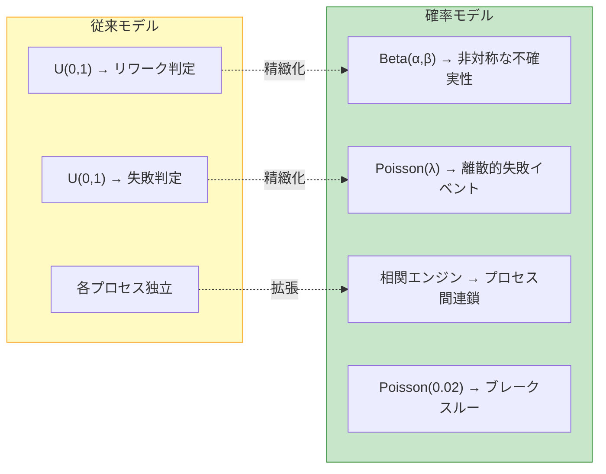
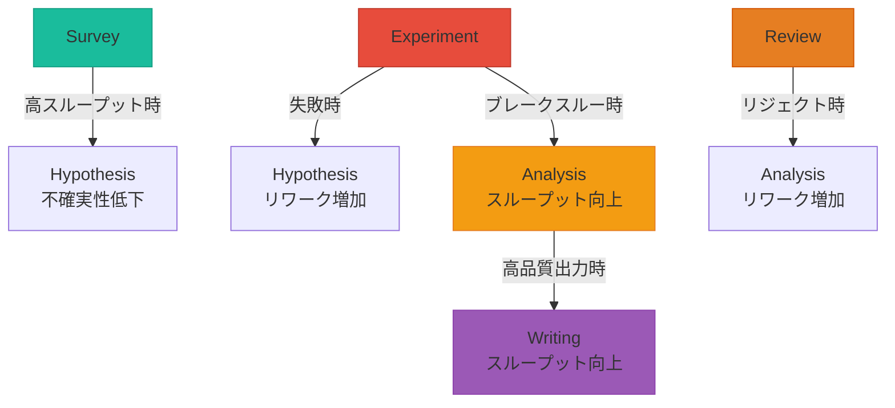
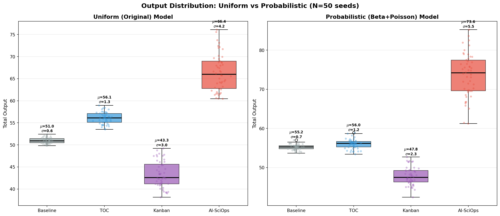
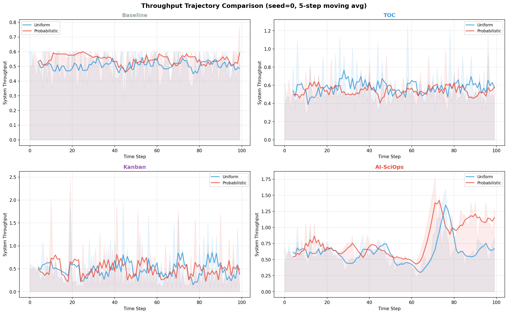
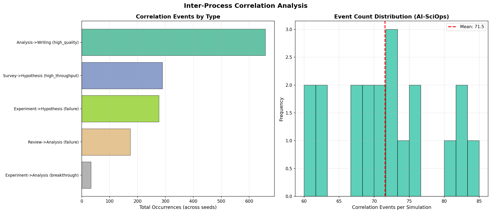

# 確率モデルの精緻化 (v7)

## 概要

従来のシミュレーションは一様乱数（`random.random()`）で不確実性・失敗を表現していた。本実験では、より現実的な確率分布に置き換え、結論の頑健性を検証する。

### 変更点

| 要素 | 従来モデル | 確率モデル |
|------|----------|-----------|
| 不確実性（リワーク） | 一様分布 `U(0,1)` | **ベータ分布** `Beta(α,β)` |
| 失敗イベント | 一様分布による閾値判定 | **ポアソン過程** `Poisson(λ)` |
| プロセス間依存 | 独立（相関なし） | **相関構造**（5ルール） |
| ブレークスルー | なし | ポアソン過程（稀少イベント） |



## ベータ分布パラメータの導出

各プロセスの`uncertainty`値からベータ分布のパラメータを導出:

```
α = max(0.5, 2.0 × (1 - uncertainty) + 0.5)
β = max(0.5, 2.0 × uncertainty + 0.5)
```

| プロセス | uncertainty | α | β | 分布の形状 |
|---------|-----------|-----|-----|-----------|
| Survey | 0.2 | 2.1 | 0.9 | 右に偏り（成功しやすい） |
| Hypothesis | 0.4 | 1.7 | 1.3 | やや左に偏り |
| Experiment | 0.5 | 1.5 | 1.5 | 対称（最大の不確実性） |
| Analysis | 0.3 | 1.9 | 1.1 | やや右に偏り |
| Writing | 0.3 | 1.9 | 1.1 | やや右に偏り |
| Review | 0.2 | 2.1 | 0.9 | 右に偏り |

AI支援が増えるとα↑（成功確率↑）、β↓（失敗確率↓）に動的調整される。

## プロセス間相関ルール



5つの相関ルール:
1. **実験失敗 → 仮説リワーク** (magnitude: 0.4, delay: 1)
2. **分析高品質 → 執筆スループット向上** (magnitude: 0.2, delay: 0)
3. **サーベイ高スループット → 仮説不確実性低下** (magnitude: 0.15, delay: 0)
4. **レビューリジェクト → 分析リワーク** (magnitude: 0.3, delay: 1)
5. **実験ブレークスルー → 分析スループット向上** (magnitude: 0.25, delay: 0)

## 実験結果

### 主要結論: **バリアントランキングは頑健**

N=50シードで4バリアント×2モデルを比較した結果:

| バリアント | 一様分布 (平均) | 確率モデル (平均) | 差分 | p値 | 有意性 |
|-----------|---------------|-----------------|------|-----|--------|
| AI-SciOps | 66.41 | 73.61 | +10.8% | <0.001 | *** |
| TOC | 56.08 | 56.01 | -0.1% | 0.788 | n.s. |
| Baseline | 50.96 | 55.22 | +8.4% | <0.001 | *** |
| Kanban | 43.29 | 47.78 | +10.4% | <0.001 | *** |

**ランキング順序は変化なし**: AI-SciOps > TOC > Baseline > Kanban

### 確率モデルによる変化の解釈

1. **AI-SciOpsが最大の恩恵** (+10.8%): ブレークスルーイベントがAI支援により増加し、相関ルールの正のフィードバックをより活用
2. **TOCはほぼ変化なし** (-0.1%): AI支援を使わないため、ブレークスルーの恩恵が少ない
3. **Baselineも恩恵あり** (+8.4%): ポアソン分布の失敗パターンが一様分布より穏やかなため
4. **Kanbanも恩恵あり** (+10.4%): プル型制御が相関イベントのフロー改善と相乗

### 相関イベント分析 (AI-SciOps)

平均72イベント/シミュレーション:
- **分析→執筆** (高品質): 658回 — 最頻イベント
- **サーベイ→仮説** (高スループット): 289回
- **実験→仮説** (失敗): 277回 — 実験失敗の仮説へのフィードバック
- **レビュー→分析** (失敗): 174回
- **実験→分析** (ブレークスルー): 33回 — 稀少だが高インパクト

## 可視化

### 出力分布比較


### ランキングシフト分析


### スループット軌跡比較


### 相関イベント分析


### 失敗・リワークパターン


### 総合サマリー


## 技術的詳細

### ベータ分布のサンプリング

純粋なPython実装（scipy不要）:
- Marsaglia-Tsang法によるガンマ分布サンプリング
- `Beta(α,β) = Gamma(α) / (Gamma(α) + Gamma(β))`

### ポアソン分布のサンプリング

Knuthのアルゴリズム:
- `P(k) = λ^k × e^(-λ) / k!`
- 失敗: `λ = failure_rate × (1 - ai_assist × 0.3)`
- ブレークスルー: `λ = 0.02 × (1 + ai_assist × 0.5)`

---

### 関連ページ

- [Home](./Home.md) | [実験の詳細設計](./Experiment-Design.md) | [コードアーキテクチャ](./Architecture.md)
- [パラメータ感度分析](./Sensitivity-Analysis.md) | [モンテカルロ実験](./Monte-Carlo-Analysis.md)
- [方法論比較](./Methodology-Comparison.md) | [今後の発展](./Future-Work.md)
