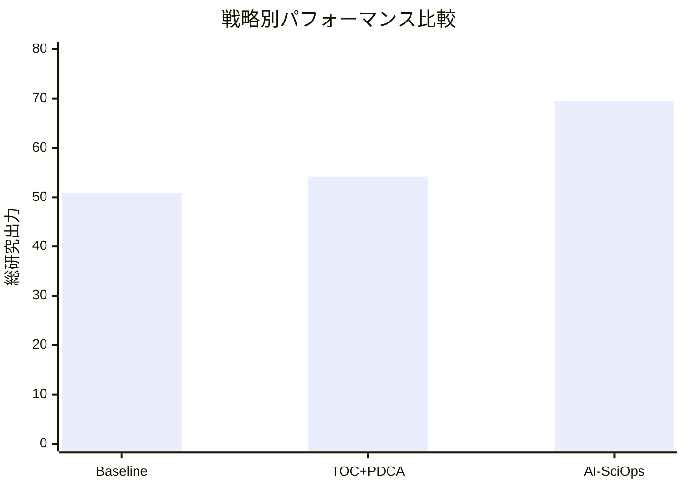
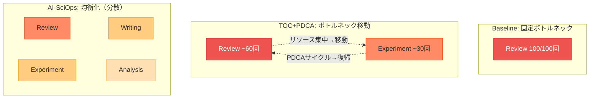
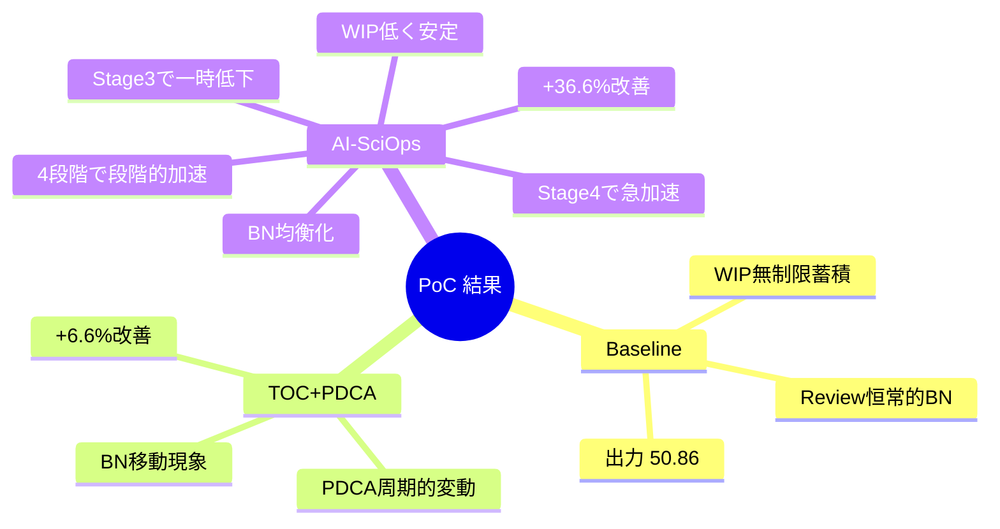

# 結果の詳細解釈

## 総合結果

| 戦略 | 総出力 | 改善率 | 最終ボトルネックスループット |
|------|--------|--------|-------------------------|
| Baseline | 50.86 | — | 0.60 (Review) |
| TOC + PDCA | 54.23 | +6.6% | 0.47 (Review) |
| AI-SciOps | 69.48 | +36.6% | 0.95 (Review) |

## 図1: 累積研究出力（01_cumulative_output.png）

### 読み方
横軸がタイムステップ（0〜100）、縦軸が累積の研究出力です。3本の線が3つの戦略を表し、線の傾きが瞬時スループット（研究の生産速度）を示します。赤い破線はAI-SciOpsの4段階の境界です。

### 発見

1. **Stage 1（0-20）では3戦略はほぼ同等**: AI-SciOpsはまだ学習中であり、人間フィードバックに依存しているため、大きな差は出ません。これは論文の「段階的に自律性を獲得する」プロセスの反映です。

2. **Stage 2-3（20-70）で徐々にAI-SciOpsが加速**: 学習したリソース配分とプロセス枝刈りの効果で、AI-SciOpsの傾きが増加します。一方、TOC+PDCAも若干Baselineを上回ります。

3. **Stage 4（80-100）でAI-SciOpsが急加速**: メタプロセス再組織化（Survey/Hypothesisの並列化、AIメタレビュー導入）により、傾きが一段と増加。最終的にBaselineの1.37倍の出力に到達します。

4. **TOC+PDCAは控えめな改善（+6.6%）**: 産業管理手法だけでも改善は得られるが、AIなしでは限界があることを示しています。

## 図2: システムスループット推移（02_system_throughput.png）

### 読み方
横軸がタイムステップ、縦軸が各ステップでのシステム出力（移動平均）。瞬時的なスループットの変動を捉えています。

### 発見

1. **Baselineは0.5前後で横ばい**: 最適化がないため、Reviewの固定的なボトルネック（0.6）に制約されています。

2. **TOC+PDCAは周期的な変動**: 10ステップのPDCAサイクルに伴い、リソース再配分のたびに小さな変動が見られます。平均的にはBaselineを若干上回りますが、劇的な改善には至りません。

3. **AI-SciOpsはStep 60-70で一時的に低下した後、急上昇**: Stage 3での構造変更（不確実性削減）が短期的に混乱を招いた後、Stage 4のメタ最適化でスループットが1.0を超える水準に到達。この「一時的な低下→その後の急改善」パターンは、プロセス再構成の過渡的コストを示しており、重要な知見です。

## 図3: ボトルネック分布（03_bottleneck_analysis.png）

### 読み方
3つの戦略それぞれについて、各プロセスが「ボトルネック（最もスループットが低いプロセス）」だった回数を棒グラフで表示。

### ボトルネック移動の動態

### 発見

1. **Baselineではreviewが100回中100回ボトルネック**: Reviewの基本スループット（0.6）が最低で、リソース均等配分では永遠にボトルネックのまま。これは現実の科学界の状況を反映しています——査読プロセスは常に遅い。

2. **TOC+PDCAではReviewとExperimentが交互にボトルネック**: TOCがReviewにリソースを集中すると、次はExperiment（2番目にスループットが低い）がボトルネックに浮上。「ボトルネックを解消すると次のボトルネックが現れる」というTOCの基本的な動態が再現されています。

3. **AI-SciOpsではボトルネックが分散**: Reviewが依然最多ですが、Writing、Experiment、Analysisにも分散。これは**全体的に均衡化された状態**を意味し、特定の一箇所だけが極端に遅いという状況が解消されています。

## 図4: スループットヒートマップ（04_throughput_heatmap.png）

### 読み方
プロセス（縦軸）×時間（横軸）のマトリクスで、色の濃さがスループットを表す。明るい色=低い、暗い/赤い色=高い。

### 発見

1. **Baselineは時間方向に一様**: 各プロセスのスループットが100ステップ通して変化しない。最適化がないため当然です。

2. **TOC+PDCAはExperimentに縦縞**: PDCAサイクルのたびにリソースが振り替わるため、ボトルネックとなるExperimentのスループットが周期的に変動。

3. **AI-SciOpsは劇的な色の変化**: Stage遷移のたびに全体の色彩パターンが変化。特にStage 2（20-）でExperimentが暗くなり（スループット向上）、Stage 4（80-）でSurvey/Hypothesisが極端に暗くなる（並列化ブースト）のが明確に見えます。

## 図5: WIP蓄積パターン（05_wip_accumulation.png）

### 読み方
6つのサブプロットが各プロセスの仕掛品（Work-In-Progress）量を示す。WIPが増え続けるプロセスは、処理能力が入力に追いつけていない（ボトルネック）ことを意味します。

### 発見（最も重要な図）

1. **BaselineのExperimentでWIPが60以上に蓄積**: Experimentの上流にあるSurvey（2.0）とHypothesis（1.5）から流入する仕事に対し、Experimentのスループット（0.8）が追いつけず、仕掛品が際限なく蓄積。これは典型的な**滞留問題**で、TOCが解決を目指す核心的な問題です。

2. **TOC+PDCAはSurveyでWIPが30以上に蓄積**: ExperimentにリソースをシフトしたことでSurveyのリソースが不足し、Surveyの方にWIPが蓄積するという**ボトルネック移動**が発生。TOCの5集中ステップの限界を示しています。

3. **AI-SciOpsはWIPが全プロセスで低く安定**: Stage 2の学習ベースのリソース配分により、WIPが蓄積しているプロセスに自動的にリソースを振り向けるため、大きな滞留が発生しません。これが**最大の差別化要因**です。

## 図6: 総合比較（06_summary_comparison.png）

### 読み方
4つの最終指標（総出力、最終ボトルネックスループット、総手戻り、総失敗）を棒グラフで比較。

### 発見

1. **総出力**: AI-SciOps (69.48) >> TOC+PDCA (54.23) > Baseline (50.86)

2. **最終ボトルネックスループット**: AI-SciOps (0.95) >> Baseline (0.60) > TOC+PDCA (0.47)。TOC+PDCAのボトルネックスループットがBaselineより低いのは、最終時点でのリソース偏りの影響です。しかしAI-SciOpsはStage 4のメタレビュー導入でReviewの人間ボトルネックを緩和し、0.95まで引き上げています。

3. **総手戻り・総失敗**: AI-SciOpsが最も低い。AI支援による不確実性削減と失敗率低下の効果です。

## 核心的な知見マップ

## 核心的なテイクアウェイ

| 知見 | 対応する論文の議論 |
|------|-----------------|
| Reviewが恒常的なボトルネック | Section 3.2: 人間レビューがボトルネックになる |
| TOCでボトルネックが移動する | Section 2: TOCの5集中ステップ |
| AI学習ベースの配分がWIP蓄積を防ぐ | Section 4.1: AI駆動の研究プロセス管理自動化 |
| Stage 3の構造変更後に一時的低下→改善 | Section 5: プロセスの枝刈り |
| Stage 4のメタ最適化が最大の加速を生む | Section 5: メタプロセス再組織化 |
| 段階的移行が効果的 | Section 5: 4段階フレームワーク |
