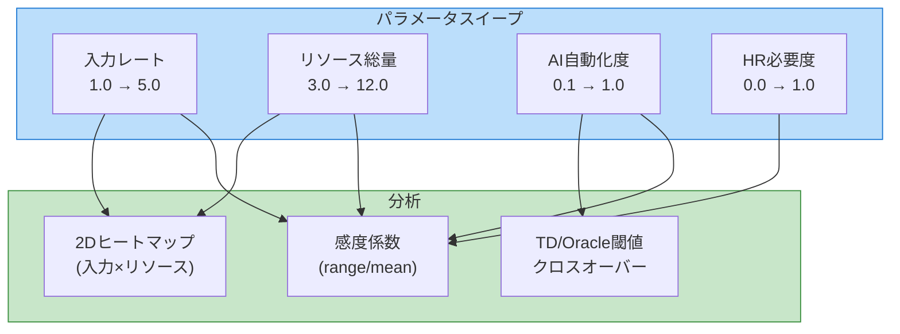
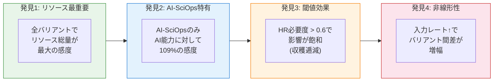
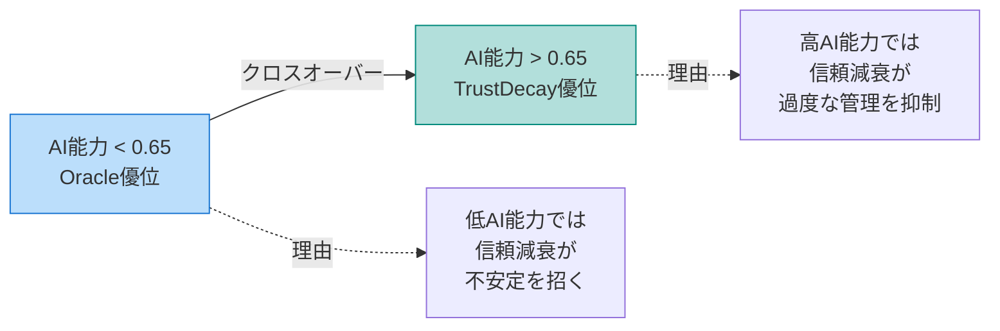
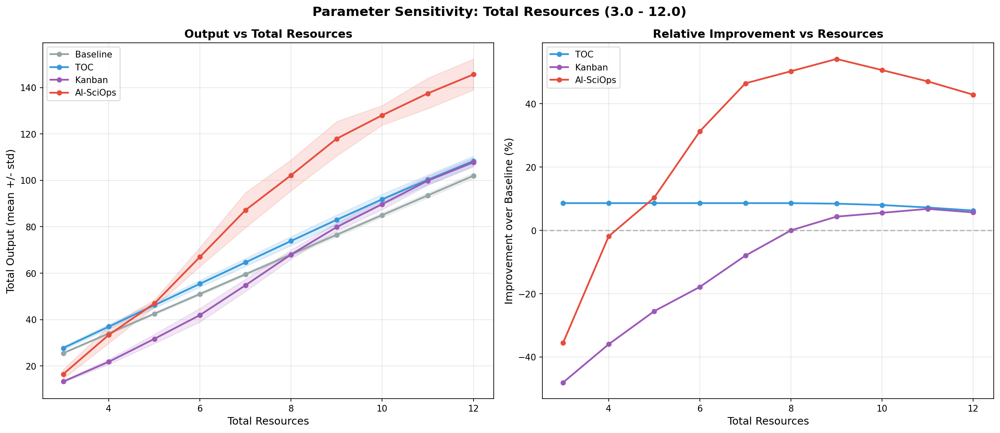
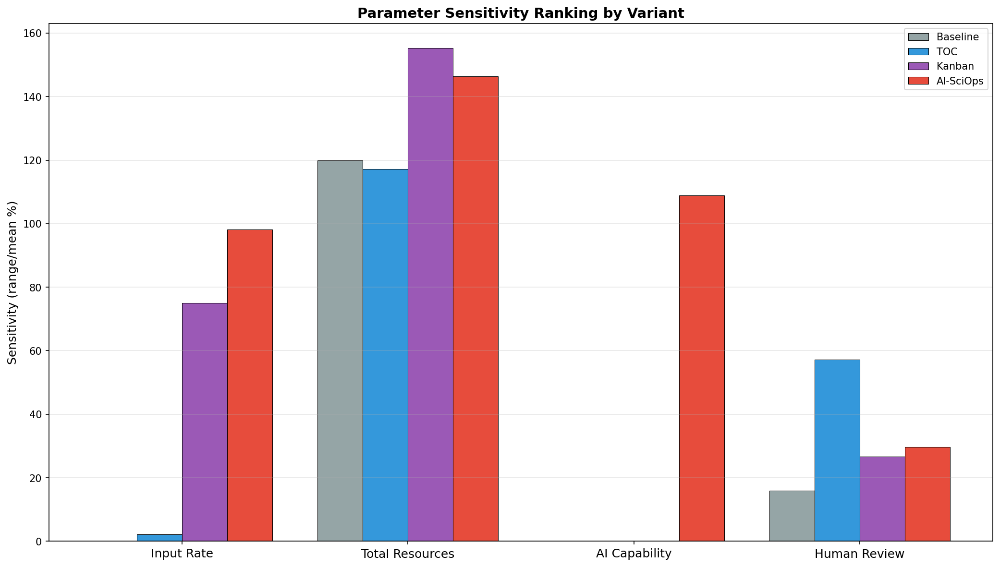

# パラメータ感度分析 (v8)

## 概要

モンテカルロ実験（v5相当）は乱数シードの感度を検証したが、**モデルパラメータ自体の感度**は未検証だった。本実験では4つの主要パラメータを系統的にスイープし、各バリアントの応答特性を明らかにする。

### スイープ対象

| パラメータ | 範囲 | ステップ数 | 意味 |
|-----------|------|----------|------|
| 入力レート | 1.0 - 5.0 | 9 | パイプラインへの作業投入速度 |
| リソース総量 | 3.0 - 12.0 | 10 | 利用可能なリソース量 |
| AI自動化度 | 0.1 - 1.0 | 10 | AIが自動化できる割合 |
| 人間レビュー必要度 | 0.0 - 1.0 | 11 | 人間レビューが必要な割合 |

さらに:
- **2Dヒートマップ**: 入力レート × リソース の組み合わせ空間
- **TrustDecay vs Oracle閾値**: AI能力水準による最適バリアントの切り替わり

## 実験結果

### 感度係数ランキング

**感度係数** = (最大値 - 最小値) / 平均値 × 100%

| バリアント | 入力レート | リソース総量 | AI能力 | HR必要度 |
|-----------|----------|------------|--------|---------|
| Baseline | 0.1% | **119.9%** | 0.0% | 15.9% |
| TOC | 2.2% | **117.2%** | 0.0% | 57.1% |
| Kanban | 75.0% | **155.2%** | 0.0% | 26.7% |
| AI-SciOps | 98.1% | **146.4%** | **108.9%** | 29.7% |

### 主要発見

## 詳細分析

### 1. 入力レート感度 (1.0 → 5.0)

- **Baseline**: ほぼ無感応 (0.1%) — 最適化なしのため入力増でもボトルネックで停滞
- **TOC**: 低感度 (2.2%) — ボトルネック集中だが入力対応力が限定的
- **Kanban**: 高感度 (75.0%) — プル型制御が入力増に対して効果的に応答
- **AI-SciOps**: 最高感度 (98.1%) — AI支援が高入力レートで最大の効果を発揮

**解釈**: 入力レートが高い環境（=研究テーマが豊富な場合）ではAI-SciOpsの優位性が顕著に拡大する。

### 2. リソース総量感度 (3.0 → 12.0)

全バリアントで最大の感度（117-155%）。リソース制約が研究生産性の根本的制約であることを示す。

- **Kanban**: 最高感度 (155.2%) — リソース配分が柔軟な分、増加の恩恵も大
- **AI-SciOps**: 高感度 (146.4%) — AI最適化がリソース増を効果的に活用
- **Baseline/TOC**: やや低い (117-120%) — 固定配分のため活用効率が劣る

### 3. AI能力パラメータ感度

- **AI-SciOpsのみ反応** (108.9%) — 他バリアントはAI支援を使わないため感度ゼロ
- AI自動化度 0.1→1.0 で出力が2倍以上に変化
- **非線形応答**: 0.5以上で加速度的に改善（Stage 2-3のAI支援効果が発動）

### 4. 人間レビュー必要度感度

- **TOC**: 最高感度 (57.1%) — ボトルネック（Review）への依存度が高い
- **AI-SciOps**: 中程度 (29.7%) — Stage 4でレビューボトルネックを緩和
- **飽和効果**: HR必要度 > 0.6 で影響が頭打ちになる（レビューキャパシティの物理的制約）

### 5. 2Dパラメータ空間

入力レート × リソース の全組み合わせでAI-SciOpsの改善率をマッピング:

- **低リソース・低入力**: 改善率は小さい（制約が強すぎてAIの効果が限定的）
- **高リソース・高入力**: 最大改善率（AI最適化の余地が最大化）
- **高入力・低リソース**: Kanbanが最適になる領域が出現（プル型制御の優位性）

### 6. TrustDecay vs Oracle クロスオーバー

| AI能力水準 | Oracle出力 | TrustDecay出力 | 勝者 |
|-----------|-----------|---------------|------|
| 0.1 | 48.2 | 42.6 | Oracle |
| 0.2 | 51.5 | 45.4 | Oracle |
| 0.3 | 54.8 | 50.5 | Oracle |
| 0.4 | 63.0 | 57.8 | Oracle |
| 0.5 | 74.2 | 68.9 | Oracle |
| 0.6 | 78.0 | 77.6 | Oracle |
| **0.65** | - | - | **クロスオーバー** |
| 0.7 | 85.1 | 86.7 | **TrustDecay** |
| 0.8 | 92.0 | 94.3 | **TrustDecay** |
| 0.9 | 98.6 | 101.7 | **TrustDecay** |
| 1.0 | 106.3 | 109.1 | **TrustDecay** |

**解釈**: AI能力が閾値（~0.65）を超えると、TrustDecayの「信頼に基づくオーバーヘッド削減」がOracleの「完全情報による最適化」を上回る。これは[ボトルネック残存世界の分析](./Bottleneck-Persists-Analysis.md)で示唆されていた仮説を定量的に確認する結果。

## 可視化

### 入力レート感度

### リソース総量感度

### AIパラメータ感度

### 2Dヒートマップ

### TrustDecay vs Oracle閾値

### 感度ランキング

---

### 関連ページ

- [Home](./Home.md) | [実験の詳細設計](./Experiment-Design.md) | [コードアーキテクチャ](./Architecture.md)
- [確率モデル分析](./Probabilistic-Model-Analysis.md) | [モンテカルロ実験](./Monte-Carlo-Analysis.md)
- [ボトルネック残存世界の分析](./Bottleneck-Persists-Analysis.md) | [今後の発展](./Future-Work.md)
